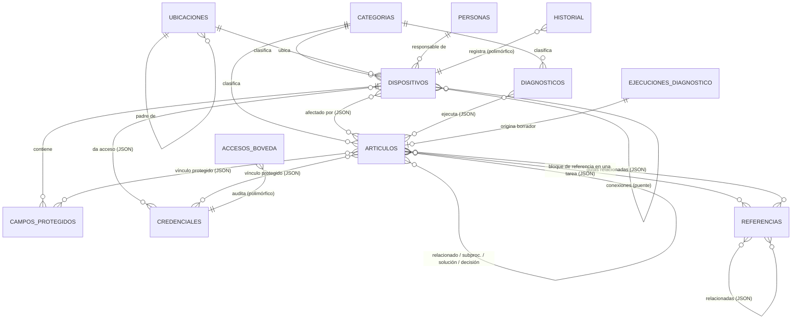
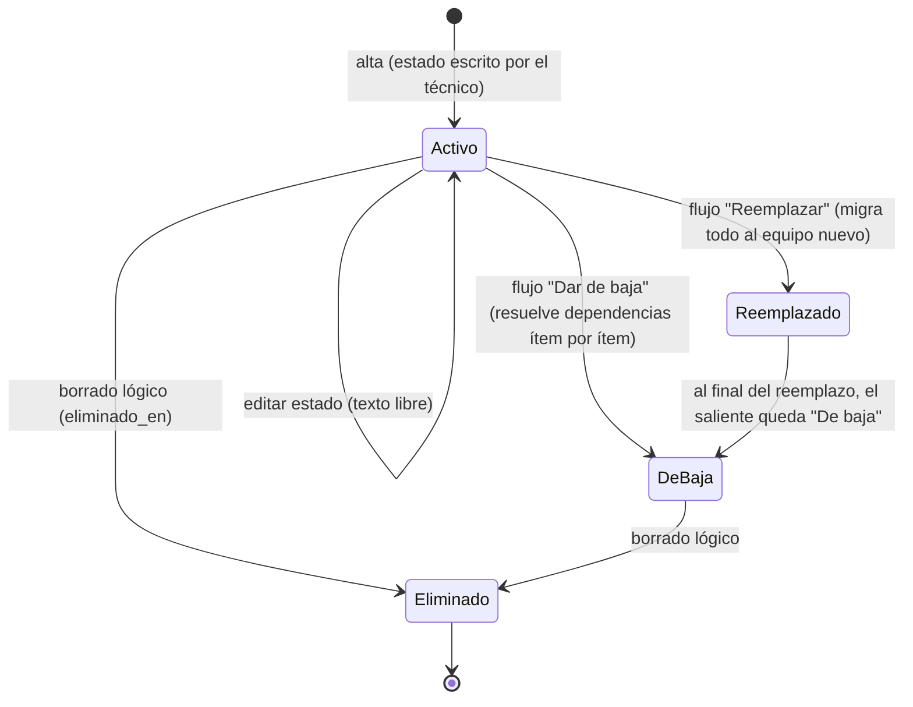
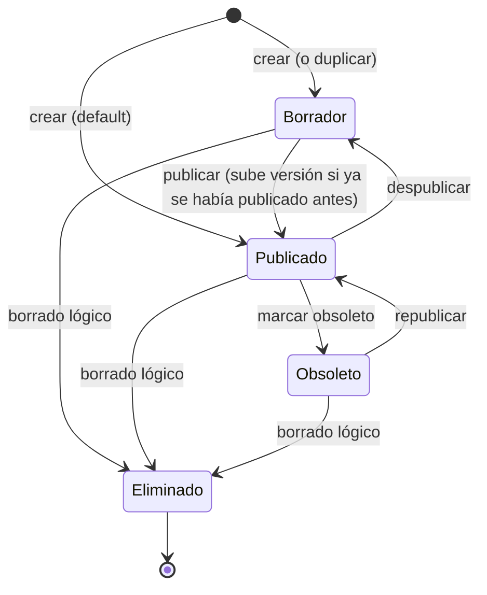
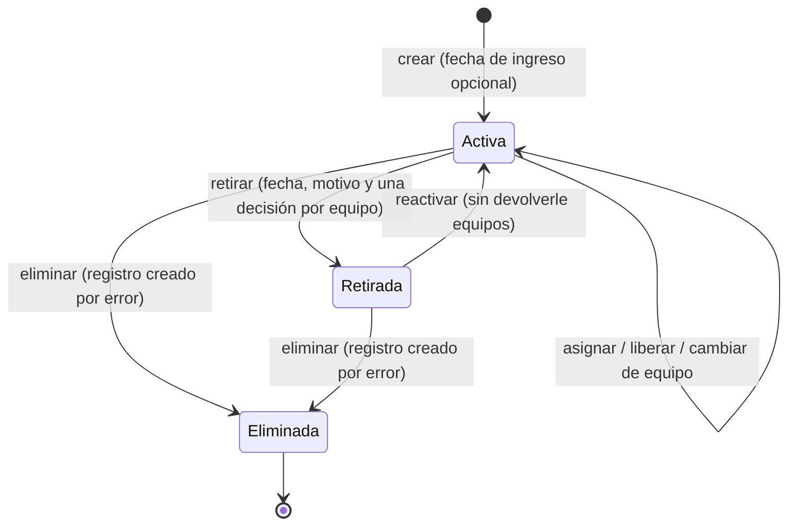
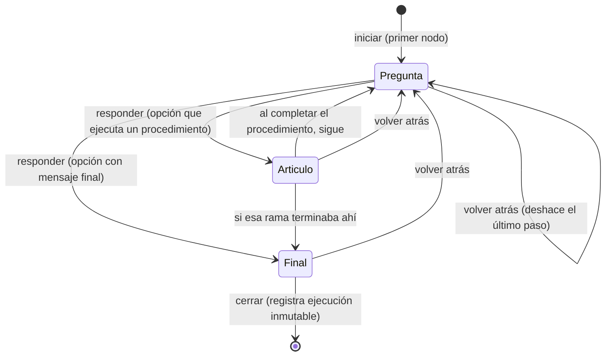
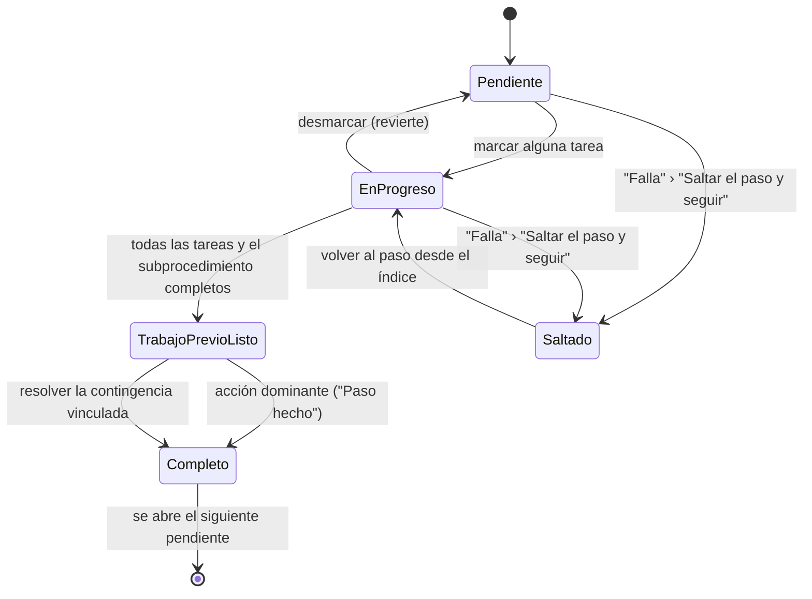
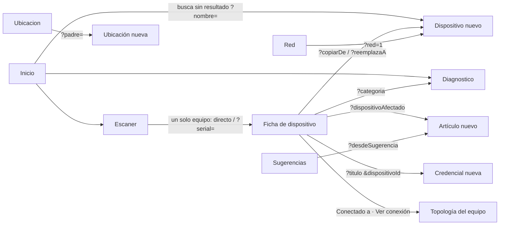

# Arquitectura funcional de Soluciones IT

Manual del comportamiento interno del sistema: reglas de negocio, permisos, ciclos de vida, eventos, dependencias, sincronización, auditoría, rendimiento, accesibilidad, navegación, modelo entidad-relación, convenciones y roadmap.

Este documento complementa a los demás, no los repite. Cada concepto vive en un solo lugar:

| Si buscas... | Está en |
|---|---|
| Stack y decisiones técnicas de implementación | [ARQUITECTURA.md](ARQUITECTURA.md) |
| Pantallas, formularios, botones y flujos del usuario | [DOCUMENTACION_FUNCIONAL.md](DOCUMENTACION_FUNCIONAL.md) |
| Componentes reutilizables (props, variantes) | [COMPONENTES_UI.md](COMPONENTES_UI.md) |
| El buscador en detalle | [BUSCADOR.md](BUSCADOR.md) |
| **Reglas de negocio, permisos, estados, eventos, dependencias, modelo E-R** | este documento |
| Decisiones de arquitectura (por qué) e historial | [DECISIONES.md](DECISIONES.md), [CHANGELOG.md](CHANGELOG.md) |

El código es la fuente de verdad. Todo lo que sigue se verificó contra `src/` y `supabase/schema.sql`; cuando el código y un documento previo discrepaban, se corrigió el documento (ver [CHANGELOG.md](CHANGELOG.md)).

## Índice

1. [Conceptos rectores](#1-conceptos-rectores)
2. [Catálogo de reglas de negocio (RN)](#2-catálogo-de-reglas-de-negocio-rn)
3. [Modelo entidad-relación](#3-modelo-entidad-relación)
4. [Ciclos de vida y máquinas de estado](#4-ciclos-de-vida-y-máquinas-de-estado)
5. [Modelo de permisos](#5-modelo-de-permisos)
6. [Eventos del sistema](#6-eventos-del-sistema)
7. [Dependencias entre entidades](#7-dependencias-entre-entidades)
8. [Arquitectura offline y sincronización](#8-arquitectura-offline-y-sincronización)
9. [Manejo de conflictos](#9-manejo-de-conflictos)
10. [Auditoría e inmutabilidad](#10-auditoría-e-inmutabilidad)
11. [Arquitectura de navegación](#11-arquitectura-de-navegación)
12. [Objetivos de rendimiento](#12-objetivos-de-rendimiento)
13. [Accesibilidad](#13-accesibilidad)
14. [Convenciones del proyecto](#14-convenciones-del-proyecto)
15. [Roadmap funcional](#15-roadmap-funcional)

---

## 1. Conceptos rectores

El principio rector del producto es **"cada dato existe una sola vez y todo lo demás lo referencia; nunca duplicar información"**. De ahí se derivan cuatro conceptos que aparecen en todo el sistema:

- **Copia de referencia:** un vínculo entre dos entidades guarda el `id` del otro extremo más una copia de su nombre o título. La copia es caché de presentación (permite mostrar el vínculo aunque la otra fila no haya sincronizado o ya no exista), nunca la fuente de verdad.
- **Referencia viva** (`src/lib/referencia.ts`): si la fila vive en la base local y no está eliminada, se muestra su dato actual; la copia congelada solo se usa cuando la fila falta o fue eliminada. Renombrar un equipo se refleja al instante en todas sus conexiones sin reescribir ninguna fila ajena.
- **Grafo derivado** (`src/lib/grafo.ts`): las relaciones N:M no se almacenan, se reconstruyen en memoria desde los datos locales, igual que el índice de búsqueda. Un grafo derivado no puede quedar desactualizado.
- **Registros inmutables:** `historial`, `ejecuciones_diagnostico` y `accesos_boveda` son solo inserción (append-only) y congelan sus textos a propósito, porque son fotos del pasado.

Detalle técnico de estos mecanismos en [ARQUITECTURA.md](ARQUITECTURA.md), sección 15.

---

## 2. Catálogo de reglas de negocio (RN)

Reglas atómicas que rigen el comportamiento del sistema. Cada una indica su motivo, las entidades involucradas y su impacto. "Dura" = impuesta por la base de datos; "blanda" = solo advertida en la interfaz.

### Integridad y unicidad

**RN-001. Todo dispositivo pertenece a exactamente una categoría.**
- Motivo: la sección Dispositivos/Red y la aplicabilidad de procedimientos parten de la categoría.
- Entidades: Dispositivo, Categoría. Dura (FK NOT NULL `dispositivos.categoria_id`).
- Impacto: no se puede crear un dispositivo sin categoría.

**RN-002. Todo artículo y todo diagnóstico pertenecen a exactamente una categoría.**
- Motivo: organizan la base de conocimiento y el Diagnóstico por categoría.
- Entidades: Artículo, Diagnóstico, Categoría. Dura (FK NOT NULL).
- Impacto: no existe contenido "sin categoría".

**RN-003. El nombre de categoría es único en todo el sistema.**
- Motivo: evitar categorías duplicadas que fragmenten el contenido.
- Entidades: Categoría. Dura (única restricción `UNIQUE` de todo el esquema).
- Impacto: la base rechaza dos categorías con el mismo nombre.

**RN-004. El serial de dispositivo se advierte como único, pero no se impone.**
- Motivo: evitar duplicados por descuido sin bloquear casos legítimos (equipos sin serial, migraciones).
- Entidades: Dispositivo. Blanda (aviso en `DispositivoForm` con enlace al duplicado).
- Impacto: dos equipos pueden coexistir con el mismo serial; el sistema solo avisa.

**RN-005. La IP de dispositivo se advierte como única, pero no se impone.**
- Motivo y mecanismo idénticos a RN-004.
- Entidades: Dispositivo. Blanda.

**RN-006. El nombre de un campo protegido es único dentro de su equipo (solo validación de formulario).**
- Motivo: no repetir "Contraseña del panel" dos veces en el mismo equipo.
- Entidades: Campo protegido, Dispositivo. Blanda (validación en memoria, no constraint).
- Impacto: un conflicto de sincronización podría crear dos con el mismo nombre; la interfaz normal lo evita.

### Dato único y referencias

**RN-007. Ningún dato se duplica: todo vínculo se guarda por `id` más una copia de referencia.**
- Motivo: el principio rector del producto.
- Entidades: todas las que se referencian entre sí (dispositivosAfectados, relacionados, credenciales.dispositivos, vinculoProtegido, conexiones, etc.).
- Impacto: renombrar una entidad no obliga a reescribir las que la referencian.

**RN-008. La copia de referencia solo se usa si la fila real no está disponible (referencia viva).**
- Motivo: mostrar siempre el dato actual y degradar con gracia offline.
- Entidades: todas las de RN-007.
- Impacto: cero escrituras de propagación, cero conflictos por renombrado.

**RN-009. Los registros inmutables congelan sus textos y nunca resuelven en vivo.**
- Motivo: son fotos del pasado; resolver en vivo reescribiría la historia.
- Entidades: Historial, EjecucionDiagnostico, AccesoBoveda.
- Impacto: el historial muestra el nombre que la ficha tenía en ese momento, no el actual.

**RN-010. El grafo de referencias es derivado; no se almacena ni se sincroniza.**
- Motivo: un grafo derivado no puede quedar obsoleto ni necesita esquema nuevo.
- Entidades: Artículo, Dispositivo, Credencial, Diagnóstico, Campo protegido.
- Impacto: agregar un vínculo nuevo no requiere migración de datos.

### Ciclo de vida y borrado

**RN-011. Todo borrado desde la app es lógico (`eliminado_en`), nunca físico.**
- Motivo: recuperar datos, propagar la eliminación como UPDATE por Realtime y conservar el historial.
- Entidades: las 10 tablas editables. Excepción: `perfiles` se borra en cascada con la cuenta de `auth.users` (única cascada de borrado físico del esquema).
- Impacto: nada se pierde de forma irreversible desde la interfaz.

**RN-012. Las tres tablas de auditoría son solo inserción.**
- Motivo: son la base de confianza de la trazabilidad y de las estadísticas.
- Entidades: Historial, EjecucionDiagnostico, AccesoBoveda.
- Impacto: nunca se editan ni se eliminan desde la app.
- Desde el 2026-09-24 (tarea 271) **el servidor sella la autoría y la llegada** de cada entrada: el trigger `sellar_registro_inmutable` pone `recibido_en` (el cursor de la sincronización) y, con sesión, `usuario` y `usuario_nombre` (el nombre del perfil, o el correo antes de la arroba, igual que la app). `fecha_hora`, el momento real del cambio, la sigue poniendo la app, porque puede ser antiguo si se hizo sin internet. Así nadie inserta una entrada firmada a nombre de otro ni la esconde de la sincronización. Y la entrada de historial de una credencial o de un campo protegido solo la escribe quien puede leerla (`puede_ver_boveda`).

**RN-013. Eliminar un dispositivo no arrastra sus dependencias; el flujo "Dar de baja" las resuelve ítem por ítem.**
- Motivo: evitar borrados en cascada silenciosos; el técnico decide qué hacer con cada conexión, credencial y campo protegido.
- Entidades: Dispositivo, Conexión, Credencial, Campo protegido.
- Impacto: un borrado directo deja referencias huérfanas (que la referencia viva degrada); "Dar de baja" las previene.

**RN-014. `reemplaza_a` se fija una sola vez al crear y nunca se limpia.**
- Motivo: es la bitácora permanente de qué equipo reemplazó a cuál.
- Entidades: Dispositivo (autorreferencia).
- Impacto: la ficha del equipo entrante siempre puede mostrar "Reemplaza a...".

**RN-015. Un campo protegido puede sobrevivir a su dispositivo.**
- Motivo: al dar de baja un equipo, el técnico puede conservar el dato sin dueño.
- Entidades: Campo protegido, Dispositivo (`dispositivo_id` nullable, sin FK).
- Impacto: existe la opción explícita "conservar sin equipo".

**RN-016. Un artículo en borrador u obsoleto se excluye del buscador global, rutas de inicio, vinculables y Diagnóstico, salvo para quien lo edita.**
- Motivo: no sugerir al equipo contenido que no es oficial.
- Entidades: Artículo.
- Impacto: los borradores propios sí aparecen en la pantalla de Soluciones de su autor.

**RN-017. La versión de un artículo solo sube al guardar un artículo que ya estaba publicado.**
- Motivo: editar un borrador repetidamente no debe inflar la versión.
- Entidades: Artículo (`version`, `estado`).
- Impacto: sube la menor por defecto, la mayor con "Cambio mayor"; duplicar reinicia a 1.0 y estado borrador.

**RN-018. Toda rama de un árbol de diagnóstico debe terminar en algo útil (mensaje final o artículo vinculado).**
- Motivo: ninguna respuesta del técnico debe llevar a un callejón sin salida.
- Entidades: Diagnóstico. Validada al guardar (junto con ausencia de ciclos y de preguntas inalcanzables).

**RN-027. Un artículo puede refinar su aplicabilidad dentro de su categoría por marca y/o modelo.**
- Motivo: distinguir "Impresora Zebra ZD230" de toda la categoría Impresoras (hallazgo H6).
- Entidades: Artículo (`aplica_a`), Dispositivo. Si marca y modelo están ambos presentes, deben coincidir los dos (AND); ausente significa toda la categoría.
- Impacto: no duplica el dato del equipo; compara en vivo texto libre normalizado.

**RN-028. Una conexión solo se crea o se elimina, nunca se edita.**
- Motivo: para corregir un puerto se quita y se vuelve a agregar; simplifica el historial.
- Entidades: Conexión.
- Impacto: no existe una operación "editar conexión"; su historial son altas y bajas.

**RN-029. El progreso de procedimientos y diagnósticos es local por técnico, nunca compartido.**
- Motivo: dos técnicos pueden ejecutar el mismo procedimiento a la vez sin pisarse.
- Entidades: progresoPasos, progresoDiagnostico (tablas locales).
- Impacto: cerrar la app o perder señal nunca pierde el avance, pero no se ve el avance de otro.

### Seguridad y permisos (resumen; detalle en la sección 5)

**RN-019. No existen roles con nombre; solo "técnico autenticado" y el permiso `puede_ver_boveda`.**

**RN-020. Solo `credenciales` y `campos_protegidos` están tras la RLS de bóveda; el resto del contenido es lectura y escritura para cualquier autenticado.**

**RN-021. La contraseña maestra es única para todo el equipo y autoriza las eliminaciones sensibles sin exigir `puede_ver_boveda` (desde 2026-07-17).**

**RN-022. Cinco eliminaciones son sensibles (exigen contraseña maestra): artículo, dispositivo, credencial, diagnóstico y campo protegido.**

**RN-023. Solo se cifra el valor secreto; los metadatos (vencimiento, nombre, tipo, vínculos) viajan en claro a propósito, para poder listar, avisar y vincular sin desbloquear la bóveda.**

**RN-024. Todo dato sensible nuevo debe vivir en una tabla con la RLS de bóveda, nunca en una columna de una tabla de lectura general.**

**RN-025. La administración de usuarios y el restablecimiento de la contraseña maestra son operaciones de infraestructura fuera de la app (panel de Supabase), no funcionalidades pendientes.**

**RN-026. No existe exportación de datos en la app; la única descarga es la plantilla CSV vacía de importación.**

### Esquema y despliegue

**RN-030. Toda columna que la app sincronice debe existir en `supabase/schema.sql`, y una columna en `camposOpcionales` nunca debe tener además un default.**
- Motivo: `aFilaRemota` emite todas las columnas declaradas; una columna faltante en el servidor hace que PostgREST rechace la fila entera y el cambio se reintente para siempre.
- Entidades: todas las sincronizadas. Verificada por la prueba automatizada `src/lib/esquema.test.ts`.
- Impacto: es la regla 17 de [REGLAS.md](REGLAS.md), con guardián automático.

### Centro de consulta

**RN-031. Una herramienta explica qué es y para qué sirve; cómo hacer algo con ella es una guía enlazada, nunca copiada.**
- Motivo: los pasos copiados en una ficha se desactualizan en cuanto alguien edita la guía, y un técnico nuevo tiene que distinguir "¿qué es esto?" (Centro de consulta) de "¿cómo lo hago?" (Guías).
- Entidades: Referencia (tipo `herramienta`), Artículo. Blanda (el editor ofrece "Guías relacionadas" y ningún campo de pasos).
- Impacto: `referencias.guias_relacionadas` guarda id y copia del título (RN-007, RN-008). Una guía en borrador se enlaza con su pastilla y sigue fuera del buscador global.

**RN-032. El uso de una herramienta en Metroparques solo se presenta como actual si está confirmado.**
- Motivo: no convertir evidencia histórica (VMware ESXi, Issabel, DOCUMENT) en un hecho actual.
- Entidades: Referencia (tipo `herramienta`). Dura en los valores (`check (estado_uso in ('', 'confirmado', 'documentado'))`), blanda en la presentación.
- Impacto: `'documentado'` se lee "Uso documentado en Metroparques; estado actual pendiente de confirmar." en la ficha y "Vigencia por confirmar" en la lista; `''` no afirma nada.

**RN-033. El Centro de consulta nunca guarda credenciales.**
- Motivo: la tabla `referencias` la lee cualquier técnico autenticado; contraseñas y accesos viven solo en la Bóveda (RN-024).
- Entidades: Referencia. Blanda (ayudas escritas bajo el comando completo y bajo "Cómo se usa en Metroparques").
- Impacto: el contenido inicial no lleva ni una dirección IP ni un acceso, y una prueba lo comprueba sobre el propio SQL.

**RN-034. Consultar una credencial fuera de su ficha deja la misma auditoría que la ficha.**
- Motivo: la vista rápida del buscador (2026-09-16, tarea 242) enseña el mismo secreto que la ficha; un segundo formato de registro dejaría huecos en la trazabilidad (RN-012).
- Entidades: Credencial, AccesoBoveda. Dura en el código: la vista rápida solo usa `descifrarCredencial`, `copiarCampoCredencial` y `registrarAccesoBoveda`.
- Impacto: desplegar la vista registra `consulto`; destapar la clave, `mostro`; copiar, `copio_usuario` o `copio_contrasena`. Ocultar no registra nada. Todo secreto arranca tapado aunque la bóveda esté abierta, y el descifrado no sale del estado de la vista (ni URL, ni almacenamiento, ni índice). Un archivo seguro no se descifra fuera de su ficha. Sin permiso de bóveda, el índice no cuenta la bóveda como abierta.

**RN-035. Sobre una tarea, el buscador global no navega.**
- Motivo: una guía en ejecución (o un editor) guarda en memoria su paso, sus avisos confirmados, sus fallas y su cronómetro; salir a otra pantalla los perdería (encargo del 2026-09-16).
- Entidades: ninguna (comportamiento de interfaz). Dura en el código: `modoConsulta.ts` (`filaNavega`, `ofreceAccionDirecta`, `vistaRapidaDe`), con pruebas puras y de flujo.
- Impacto: en el nivel `tarea` del chasis la capa se abre en modo consulta: las fichas que se pueden resolver ahí se consultan en su vista rápida, el resto queda como referencia sin enlace y no se ofrece empezar, continuar o repetir otra guía ni iniciar un diagnóstico.

### Guías en ejecución (encargo del 2026-09-17, tarea 244)

**RN-036. Abrir una guía con pasos es ejecutarla.**
- Motivo: la app es un cuaderno operativo; entre abrir la guía y hacer el paso 1 no puede haber una portada con un botón (AD-040).
- Entidades: Artículo, ProgresoPasos. Dura en el código: `GuiaPage` (dirección `/soluciones/:categoria/:articulo`), `procedimientoEjecutable`.
- Impacto: con pasos, la dirección abre la ejecución en el primer paso pendiente; sin pasos, la lectura. La ficha de una guía con pasos vive en `/detalles`. `/ejecutar` redirige a la guía. Ninguna dirección cambia de significado para un enlace guardado: sigue llevando a la misma guía.

**RN-037. Abrir una guía terminada estrena un caso; abrir una a medias la retoma.**
- Motivo: quien abre una guía que ya terminó viene a hacerla otra vez; quien la dejó a medias, a seguir (AD-040, decisión 2).
- Entidades: ProgresoPasos. Dura en el código: `AsistenteVista` (lectura inicial), `guiaTerminada`, `reiniciarProgreso`.
- Impacto: solo en la guía principal (nivel 0). Si el avance guardado cumple `guiaTerminada` (pasos cerrados y comprobaciones finales hechas), se borra al abrir y se entra en el paso 1. Si hay avance a medias se entra en el primer paso pendiente y se ofrece empezar de nuevo; nada se borra sin ese gesto. Dentro de una ejecución, una guía vinculada terminada se respeta.

**RN-038. Un aviso nunca detiene el recorrido, y su tono decide cómo se ve.**
- Motivo: confirmar cada aviso enseñaba a no leerlos; una alerta solo destaca si hay pocas y están donde aplican (AD-040, decisión 3; regla 20 de REGLAS.md).
- Entidades: BloquePaso (`tono`, `alcance`, `tareaId`). Dura en el código: `presenciaDeAviso` (tonos.ts), `tareasParaFoco` y `avisosDeTareaFoco` (tareasFoco.ts), con pruebas.
- Impacto: precaución e importante, alerta antes de la instrucción de su tarea; dato técnico, a la vista sin color de alerta; información y consejo, plegados. Los avisos del paso (o heredados sin asignar) van solo con la primera acción del paso. Un aviso no cuenta como tarea, no se confirma, no se guarda en el avance y no se deduplica por texto.

**RN-039. "Requisitos" (hasta el 2026-09-22, "Antes de empezar") solo se muestra al empezar, y solo si hay requisitos.**
- Motivo: los requisitos son lo que debe estar listo antes del paso 1; repetirlos a mitad del trabajo, o enseñar una sección vacía, es lectura sin utilidad (regla 20b).
- Entidades: Procedimiento (`requisitos`), ProgresoPasos. Dura en el código: `AsistenteVista` (`requisitosVisibles`), `AntesDeEmpezar`.
- Impacto: se muestra sobre la primera acción del paso 1 cuando la ejecución no tiene ninguna tarea ni paso marcado, en las dos vistas de la ejecución. En los detalles de la guía se sigue leyendo siempre. La línea "Retomas en el paso N", en cambio, se va con la primera acción que se marca: quien toca "Siguiente" ya eligió seguir ("Empezar de nuevo" sigue en el índice).

### Escribir una guía (segunda pasada del encargo del 2026-09-17)

**RN-040. Un aviso nuevo nace como Información; la alerta la elige el autor.**
- Motivo: nacía en Precaución (de cuando el botón era "+ Advertencia"), así que toda nota que el autor no se acordaba de suavizar salía como alerta de color y las alertas dejaban de destacar (regla 20c, AD-041).
- Entidades: BloquePaso (`tono`). Dura en el código: `crearBloqueAviso` (`src/lib/procedimiento.ts`), con prueba en `revisionGuia.test.ts`.
- Impacto: solo en los avisos que se crean desde ahora; los guardados conservan su tono. Al ejecutar, un aviso nuevo queda plegado en "Más información" hasta que el autor lo pase a Precaución o Importante.

**RN-041. El editor señala lo que la regla 20 pide corregir, sin impedir guardar; los requisitos no puntúan.**
- Motivo: la ejecución enseña lo que la guía dice; una tarea que encadena cinco acciones, un requisito que es un paso o un recordatorio vestido de alerta la hacen confusa aunque la pantalla esté bien (AD-041). La completitud pedía requisitos a toda guía y empujaba a rellenar "Antes de empezar" con acciones.
- Entidades: Procedimiento (`requisitos`), BloquePaso (`texto`, `tono`, `tipoTarea`). Dura en el código: `revisionGuia.ts` (`revisarGuia`, `accionesEncadenadas`, `esAccionDePantalla`, `esRecordatorio`), `dividirTarea` (bloquesEditor.ts) y `senalesDeArticulo` (completitudArticulo.ts), con pruebas puras y de flujo.
- Impacto: tres señales de completitud que solo existen cuando hay algo que corregir, pistas en la línea concreta, "Dividir en N tareas" (conserva la tarea original, su id, sus apoyos y su avance) y "Pasar a Información". Nada cambia en la ejecución ni en los datos guardados hasta que el autor toca y guarda. Una guía sin requisitos está completa.

---

**RN-042. El buscador prioriza la intención de resolver: una guía que coincide en el título va primero, publicada o no.**
- Motivo: buscando "DIAN" el técnico quiere HACER el procedimiento que se llama así. El índice solo lleva lo publicado (y así sigue), así que la guía en borrador quedaba debajo de la ficha de la herramienta que la acompaña, o directamente parecía no existir. La coincidencia fuerte se promueve en la PRESENTACIÓN; el estado del artículo no se toca.
- Orden: (1) guía publicada que coincide en el título; (2) guía en borrador que coincide en el título; (3) el resto de resultados oficiales (referencias, equipos, diagnósticos, categorías); (4) borradores que solo coinciden por etiqueta, categoría o tipo, en el bloque "Borradores coincidentes".
- Entidades: Artículo (`estado`, `eliminadoEn`, `titulo`, `etiquetas`, `categoriaId`). Dura en el código: `borradoresEnBusqueda.ts` (`esBorradorVivo`, `borradoresCoincidentes`, `repartirBorradores`, `hayGuiaPublicadaEnTitulo`, `sinLosYaOficiales`) y `BorradoresCoincidentes.tsx`. `documentosDeBusqueda` NO cambia.
- Impacto: un borrador promovido se abre con un toque en su procedimiento (`/soluciones/:categoriaId/:articuloId`, RN-036), lleva siempre "Borrador · contenido por confirmar" y su ejecución muestra un aviso no bloqueante. Publicarlo lo pasa al índice y retira ambas marcas, sin duplicarlo.

---

**RN-043. Con un solo equipo, el escáner abre su ficha; al volver, no reabre la misma etiqueta.**
- Motivo: el QR es otra forma de buscar (encargo del 2026-09-22, sección 18, [DECISIONES.md](DECISIONES.md) AD-044). La tarjeta "Equipo identificado" con "Abrir la ficha" era un toque más para llegar a lo único que se quería ver.
- Regla: `resolverCodigo` da `dispositivo` y el escáner navega a `/dispositivos/:id` con el origen `/escaner` ("Escáner"), apilado (sin `replace`). Antes anota el código (`marcarAbierto`). Al volver, `crearFiltroReapertura(ultimoAbierto())` ignora ese código mientras la cámara lo vea: cinco cuadros seguidos sin código (un segundo) o un código distinto lo liberan. Lo escrito a mano no pasa por el filtro.
- `varios` y `no_encontrado` siguen con sus tarjetas. `asistencia` (una URL de cualquier origen con ruta `/conectar` y `codigo` de 6 cifras) da una tarjeta neutra: el emparejamiento es la tarea 258. Un número de 6 cifras escrito a mano sigue siendo una placa.
- Estado: `sessionStorage` (`escaner:codigos-leidos`, `escaner:ultimo-abierto`), por pestaña y sin sincronizar. Dura en el código: `src/features/escaner/{resolverCodigo,sesionEscaneo}.ts`.

---

**RN-044. Buscar en Equipos incluye los equipos de red, aparte; "Conectado a" es el enlace de subida.**
- Sin texto, Equipos es el inventario general (sin las categorías `es_red`). Con texto y sin chip de categoría, además, los equipos de red que coinciden, en el bloque "Equipos de red" (`buscarEquipos`). Campos: nombre, IP, ubicación, serial, placa, marca y modelo; orden natural por nombre. El chip "Todos" cuenta también los de red (`conteosDeChips`). Dura en el código: `src/features/dispositivos/busquedaEquipos.ts`.
- La búsqueda sobrevive al salto a una ficha (estado de navegación, el mismo mecanismo que Resolver) y el chip va en la URL (`?categoria=`); un equipo de red abierto desde Equipos vuelve a Equipos.
- "Conectado a" en la ficha: el primer enlace (`tipo = 'enlace'`, no eliminado) en el que el equipo es el DESTINO, porque el origen es su padre en la topología (`arbol.ts`), ordenado por puerto; se enseñan el nombre vivo del otro equipo y SU puerto (`conectadoA`, `textoConectadoA` en `src/lib/conexiones.ts`), y "y N más" si hay más subidas. `instalacion` y `relacionado` no cuentan.

---

**RN-045. Una guía con preguntas se entra desde Resolver, se sale a donde se vino y su procedimiento tiene avance propio.**
- Un diagnóstico es, para quien resuelve, una "guía con preguntas" (`ROTULO_RECORRIDO`): sale en el buscador de Resolver junto a las guías, la intención decide el orden (un problema pone primero la guía con preguntas; un procedimiento, la guía) y la fila la abre, sin botón aparte. Su ejecución (`/diagnostico/:id`) cuelga de Resolver; la X vuelve al origen del salto (la búsqueda, con lo escrito; la lista "Guías con preguntas" con su filtro; las estadísticas; la categoría; el historial) o, sin origen, a Resolver. Salir sin haber respondido nada descarta la sesión.
- **Su administración vive en Guías (desde la tarea 269, AD-050).** La lista (`/diagnostico`, "Guías con preguntas"), crear, editar, sugerencias y estadísticas ya no cuelgan de Más: la lista sube a Guías (`padreDe`), todo `/diagnostico` ilumina Resolver (`destinoPrincipalDe`) y su puerta es la fila "Guías con preguntas" del catálogo, que con una categoría elegida cuenta y abre las de esa categoría. La ficha de un equipo abre la lista de su categoría con su origen, así que vuelve al equipo. Ninguna tabla, ruta ni lógica del diagnóstico cambió.
- El procedimiento de una respuesta se ejecuta dentro del recorrido con `AsistenteVista` y su avance vive en `recorrido:<diagnosticoId>` (`progresoPasos`). La fila de la guía no se lee ni se escribe: la guía no se reinicia ni aparece como empezada. Volver a elegir la misma respuesta tras "Volver a la pregunta" conserva lo hecho; otra guía empieza de cero; terminarla (todos sus pasos y la verificación final) o descartar el recorrido borra ese avance. Al terminarla, el recorrido sigue solo.
- Recientes de Resolver lista guías y guías con preguntas juntas; una guía con preguntas a medias dice dónde va. Abrirla y salir sin responder no la deja a medias.
- Dura en el código: `src/lib/progresoDiagnostico.ts`, `src/lib/navegacion.ts` (`esRecorridoEnEjecucion`, `destinoPrincipalDe`), `src/features/diagnostico/{DiagnosticoRunPage.tsx,DiagnosticosPage.tsx}`, `src/features/soluciones/SolucionesPage.tsx` (la puerta), `src/features/inicio/resolver.ts` (`recorridosRecientes`, `dondeVaElRecorrido`, `juntarRecientes`).

---

**RN-046. Cada final dice cómo termina; recorrer todo no es resolver.**
- Una respuesta terminal lleva `resultado`: sin indicar, Solucionado, Sigue sin resolverse, Hay que escalar o Falta información o un requisito. Solo en las terminales: en una que sigue a otra pregunta se descarta al normalizar y al guardar.
- Sin indicar (todo el contenido anterior) y Solucionado preguntan "¿Quedó resuelto el problema?" (y, si no, el motivo). Los otros tres no preguntan: la ejecución se registra con `resuelto = 'no'` y `motivo = ''`. No hay valores nuevos en `ejecuciones_diagnostico`.
- El validador de siempre (`validarNodos`: ciclos, destinos inexistentes, ramas sin salida, inalcanzables) acepta como salida útil una respuesta que solo dice cómo termina.
- Dura en el código: `src/lib/diagnostico.ts` (`RESULTADOS_RECORRIDO`, `resultadoValido`, `resultadoDelFinal`, `pideConfirmacion`).

---

**RN-047. Más reparte sus destinos en cinco grupos, una puerta por capacidad; no enseña filas vacías y Red vuelve a donde se dejó.**
- Motivo: encargo del 2026-09-22, sección 6 de `PROPUESTA_REDISENO_RESOLVER.md` ([DECISIONES.md](DECISIONES.md) AD-046), revisado por el encargo del 2026-09-23, secciones 16 a 22 (AD-049, tarea 268). Más es un índice de destinos: cada grupo responde una pregunta y nada de lo que lista es un pendiente.
- Regla: cinco grupos, en este orden: Consulta (Centro de consulta, Agenda, Mis favoritos), Organización (Personas, Ubicaciones), Infraestructura (Red), Herramientas (Herramientas de inventario; Diagnóstico salió en la tarea 269, con su puerta en Guías, RN-045) y Aplicación (Ajustes). Una capacidad, una fila: Topología se abre desde Red; Importar equipos, Etiquetas QR y los datos por ordenar, desde Herramientas de inventario (`/inventario`); la cuenta, la contraseña, el bloqueo, el trabajo sin conexión, la instalación y la actualización, desde Ajustes (`/cuenta`). Ninguna ruta se retira. "Mis favoritos" solo se monta con al menos un favorito (`obtenerFavoritos()`) y se despliega en el sitio. "Actividad del equipo" no está en Más: va al final de `/agenda`, plegada y solo si hay actividad; no cuenta en el resumen de la agenda ni en el número de Resolver.
- Red recuerda su nodo sin ser pestaña: `RAICES_CON_MEMORIA` (`RAICES_DE_PESTANA` más `/red`) es la lista con la que el chasis anota la búsqueda de cada raíz, y la fila Red de Más pide su destino con `destinoDePestana('/red', pathname, RAICES_CON_MEMORIA)`. `RAICES_DE_PESTANA` no cambia: sigue decidiendo qué es una pestaña.
- Lo que se abre DENTRO de una puerta vuelve a ella: Importar y Etiquetas suben a Herramientas de inventario (`padreDe`), y mientras están abiertas se ilumina Más aunque vivan bajo `/dispositivos` (`destinoPrincipalDe`, conjunto `HERRAMIENTAS_DE_INVENTARIO`); Etiquetas abierta desde la ficha de un equipo vuelve a él (origen); las migraciones de ubicaciones y personas vuelven a donde se abrieron; Bloqueo y seguridad sube a Ajustes; Topología, a Red. **Pendiente (tarea 265):** la Agenda sube a Resolver aunque se abra desde Más.
- Dura en el código: `src/features/mas/{PantallaMas.tsx,FilasMas.tsx}`, `src/features/inventario/HerramientasInventarioPage.tsx`, `src/features/autenticacion/CuentaPage.tsx`, `src/lib/navegacion.ts` (`HERRAMIENTAS_DE_INVENTARIO`, `PUERTA_INVENTARIO`), `src/app/memoriaPestana.ts` (`RAICES_CON_MEMORIA`), `src/features/historial/ActividadDelEquipo.tsx`, `src/features/inicio/AgendaPage.tsx`.

---

**RN-048. Una persona se retira, no se elimina; eliminar es para un registro creado por error.**
- Motivo: encargo del 2026-09-23, secciones 3, 4 y 25 ([DECISIONES.md](DECISIONES.md) AD-047). Una salida de personal no debe borrar la historia.
- Regla: `personas.estado` es `activa` o `retirada` (default `activa`; una fila sin la columna se lee como activa). Retirar guarda `fecha_retiro` y `motivo_retiro`, resuelve ANTES cada equipo que la persona tiene hoy (dejarlo sin responsable, pasarlo a otra persona activa o darlo de baja) y cambia el estado AL FINAL: si se interrumpe, la persona sigue activa con los equipos que faltan. Reactivar vacía los datos del retiro en la ficha (quedan en su historial) y no le devuelve ningún equipo. A una persona retirada no se le asignan equipos (el selector y "Asignar" solo ofrecen activas). Sin estado "pendiente": una `fecha_ingreso` futura ya lo dice. Solo datos de la operación de TI: nada de Recursos Humanos.
- Entidades: Persona, Dispositivo, Historial.
- Dura en el código: `src/features/personas/{cicloPersona.ts,operaciones.ts}` (`retirarPersona`, `reactivarPersona`).

---

**RN-049. Quién tuvo cada equipo se reconstruye del historial; ninguna fecha se inventa.**
- Motivo: sección 5 del encargo. El historial ya es el registro inmutable de cambios; una tabla `asignaciones_dispositivo` habría guardado dos veces la misma verdad.
- Regla: desde el 2026-09-23 el cambio de `responsable_id` de un equipo deja su propia entrada en `historial` (entidad `dispositivo`, campo `responsableId`, con el id de la persona anterior y el de la nueva), junto a la entrada `responsable` con los nombres. El equipo de HOY es `dispositivos.responsable_id`; los periodos pasados se derivan ordenando esas entradas por fecha (`periodosDeAsignacion`): una asignación anterior a los registros (inventario institucional, migración de personas) solo dice cuándo terminó ("Hasta el …"), nunca cuándo empezó. No se empareja por nombre: la entrada `responsable` anterior al cambio solo tiene nombres, y deducir de un nombre que dos personas son la misma sería inventar. La entrada `responsableId` es técnica: el visor del historial y la actividad del equipo la ocultan (`esEntradaTecnica`).
- Entidades: Historial, Dispositivo, Persona.
- Dura en el código: `src/lib/repositorio.ts` (`CAMPOS_SIN_HISTORIAL`), `src/features/personas/historialAsignaciones.ts`, `src/features/historial/textoHistorial.ts`.

---

**RN-050. Un equipo de baja no es equipo actual de nadie; la baja y el reemplazo sueltan al responsable.**
- Motivo: secciones 4 y 9 del encargo. Hasta el 2026-09-23 la baja (y el final de un reemplazo) dejaba `responsable_id` puesto: el equipo retirado seguía siendo "equipo actual" de su persona, y tras un reemplazo los dos equipos quedaban a su nombre.
- Regla: `darDeBajaEquipo` pone `estado = 'De baja'`, `responsable_id = null` y `responsable = ''` en un mismo guardado (el nombre queda en el historial, con el motivo). Lo usan la pantalla de baja, el reemplazo y el retiro de una persona (este solo cuando el equipo no tiene conexiones, credenciales ni datos protegidos; si los tiene, lo deja sin responsable y la baja se completa en su pantalla). Al leer, un equipo de baja que todavía conserve el vínculo (datos anteriores) no cuenta como equipo actual (`equiposActuales`) y su ficha dice "Último responsable". La fecha y el motivo de una baja son los de su entrada `estado → De baja` en el historial: no hay `fecha_baja` ni `motivo_baja`.
- Entidades: Dispositivo, Persona, Historial.
- Dura en el código: `src/features/personas/operaciones.ts` (`darDeBajaEquipo`), `src/features/dispositivos/{DarDeBajaPage,ReemplazoPage}.tsx`.

---

**RN-051. Cinco estados de equipo; "Disponible" solo cuando funciona; un texto que no es una persona queda "por validar".**
- Motivo: secciones 8 y 9 del encargo.
- Regla: la lista canónica (`topologiaVisual.ts`, única fuente) es Operativo, **Disponible**, En mantenimiento, Fuera de servicio y De baja. "De baja" conserva su texto (el que ya escriben la baja y el reemplazo) y reconoce "Dado de baja" como sinónimo (`estadoCanonico`); un texto que no está en la lista se conserva tal cual y no se interpreta. Al dejar un equipo sin responsable: si funcionaba (Operativo o Disponible) se ofrece Disponible marcado; si su estado no lo dice, se ofrece sin marcar; si está en mantenimiento, fuera de servicio o de baja, conserva su estado (`sugerirDisponible`). Al asignarlo, un Disponible pasa a Operativo y cualquier otro estado se conserva (`estadoAlAsignar`). Un `responsable` escrito sin `responsable_id` ("Archivo", "Disponible en…", dos nombres) se enseña como "Sin responsable · Anotado: «…» · por validar": nunca se convierte en persona ni se limpia solo.
- Entidades: Dispositivo, Persona.
- Dura en el código: `src/features/red/topologiaVisual.ts`, `src/features/personas/cicloPersona.ts`.

---

**RN-052. La migración de ubicaciones solo une sola lo equivalente; lo que se parece lo decide el técnico, y lo que ya existe se reutiliza.**
- Motivo: secciones 10 a 12 y 24 del encargo del 2026-09-23 ([DECISIONES.md](DECISIONES.md) AD-048). Con 0 de 149 equipos vinculados y solo 2 ubicaciones creadas, la migración es el paso que convierte el texto en entidades, y no puede inventar lugares.
- Regla: EQUIVALENCIA SEGURA es la misma clave sin mayúsculas ni espacios de sobra (`claveUbicacion`, conserva las tildes): esos textos van juntos de entrada y la pantalla lo enseña. POSIBLE COINCIDENCIA (`coincidenciaDeUbicacion`) es solo tildes, una abreviatura palabra por palabra (iniciales de palabras seguidas como «PN» = «Parque Norte», o el comienzo de una palabra de al menos 3 letras) o una o dos letras cambiadas en un nombre largo sin números: se señala en el texto con menos equipos y ese texto no se migra hasta que el técnico dice "Es el mismo lugar" o "Son distintos". Un nombre final que coincide con UNA ubicación existente la reutiliza; si coincide con varias, el grupo no se aplica. Las nuevas nacen en la raíz: la migración no crea jerarquías. Un texto contenido en otro ("Archivo" y "Archivo Central") no se señala: suele ser un lugar dentro de otro, y eso se decide colgándolo desde su ficha.
- "¿Qué hay aquí?": la ficha agrupa por la categoría real del equipo (`contenidoDeUbicacion`), no por el parecido de su nombre; las cuentas de la lista y de las sub-ubicaciones suman toda la rama (`totalConSububicaciones`).
- Entidades: Ubicación, Dispositivo, Historial.
- Dura en el código: `src/features/ubicaciones/{migracion.ts,contenido.ts,MigracionUbicaciones.tsx,UbicacionPage.tsx}`.

---

**RN-053. Un estado escrito a mano se unifica solo con confirmación: lo equivalente viene propuesto, lo que se parece se valida y lo que no dice cómo está el equipo se queda como está.**
- Motivo: sección 9 del encargo del 2026-09-23 ([DECISIONES.md](DECISIONES.md) AD-049). `estado` es texto libre y el inventario institucional trajo el suyo ("OPERATIVO", "Activo", "Dañado"); la lista canónica son cinco (RN-051), y el encargo prohíbe inferir el estado de un equipo.
- Regla: los textos se agrupan sin distinguir mayúsculas ni espacios (`claveEstado`); los que ya están escritos exactamente como en la lista y los vacíos no entran (darle un estado a un equipo sin estado sería inventarlo). EQUIVALENCIA SEGURA es un texto que `estadoCanonico` reconoce (la lista con otras mayúsculas, tildes o espacios, o el sinónimo declarado "Dado de baja"): viene propuesto hacia su forma canónica y se puede desmarcar. Cualquier otro texto viene en "Dejar como está"; si es una palabra conocida (`sugerenciaDeEstado`: "Activo" o "En uso" → Operativo, "Libre" → Disponible, "En reparación" → En mantenimiento, "Dañado" → Fuera de servicio, "Baja" → De baja) se dice lo que parece, sin elegirlo. No sugieren nada las palabras que no dicen si el equipo funciona ni si ya salió: "Inactivo", "Asignado", "En bodega", "Stock", "Fuera de uso", "Para baja", "Obsoleto".
- Al aplicar, cada equipo se relee y solo se escribe si su estado sigue siendo el que se vio (otro teléfono pudo cambiarlo); el cambio pasa por `guardarRegistro` (historial con el motivo "Unificación de estados" y cola de sincronización). Lo marcado "Dejar como está" sigue así después de unificar. Escribir bien "De baja" no es dar de baja: no suelta al responsable ni resuelve dependencias (eso es la pantalla de baja, RN-050); al leer, un equipo "De baja" que conserve el vínculo no cuenta como equipo actual de nadie.
- Entidades: Dispositivo, Historial.
- Dura en el código: `src/features/dispositivos/estadosEscritos.ts`, `src/features/inventario/EstadosPorUnificarPage.tsx`.

---

**RN-054. La agenda avisa lo que piden los ingresos, los retiros y los equipos que se sueltan, y nada de calidad del inventario.**
- Motivo: secciones 14 y 15 del encargo del 2026-09-23 ([DECISIONES.md](DECISIONES.md) AD-051). La agenda es para lo que requiere una acción; una persona que llega sin computador, una retirada con equipos a su nombre o un equipo libre que espera dueño lo son.
- Regla: tres asuntos derivados, sin tabla nueva (`asuntosDePersonas.ts`). (1) `persona_ingreso`: persona activa con `fecha_ingreso` entre +30 y -30 días de hoy (`DIAS_AVISO_VENCIMIENTO`, `DIAS_TRAS_INGRESO`) y sin equipos actuales (`equiposActuales`, que no cuenta los de baja); su fecha es la del ingreso. (2) `persona_retirada`: persona retirada con equipos actuales; su fecha es la del retiro (sin fecha, "Por revisar"; con un retiro a más de 30 días, nada). (3) `equipo_liberado`: la ÚLTIMA entrada de asignación del equipo en los últimos 14 días (`DIAS_LIBERADO_RECIENTE`) lo soltó (`responsableId` de alguien a vacío), y hoy sigue sin responsable y en estado canónico Disponible; sin fecha, "Por revisar". Una persona sin fecha de ingreso nunca es un asunto. Las entradas del historial se leen por su índice de fecha, solo las recientes.
- Lo que tiene fecha se ordena con las credenciales y los datos protegidos (una sola lista por fecha, RN de la agenda); lo que no, va a "Por revisar del equipo". Solo lo vencido y lo de hoy suman al número de la pestaña Resolver.
- Entidades: Persona, Dispositivo, Historial.
- Dura en el código: `src/features/inicio/{asuntosDePersonas.ts,pendientes.ts,usePendientes.ts,agenda.ts,SeccionesAgenda.tsx}`.

---

**RN-055. "¿Qué hace?" solo con el valor exacto de un comando o un atajo que tiene ficha; la guía no copia la ficha.**
- Motivo: sección 14 del encargo del 2026-09-23 (AD-051). Muchas instrucciones escriben el comando sin enlazar su ficha, y el técnico no sabe que el Centro de consulta lo explica.
- Regla: `comandosEnTexto` busca en el texto de la tarea el `valor` de las fichas vivas de tipo comando o atajo, sin distinguir mayúsculas, con los espacios colapsados y sin espacios alrededor de "+", y con bordes de palabra ("ping" no está en "pingüino"). Un hueco del valor (`[dirección]`, `<usuario>`, `{x}`) vale por una palabra; los del final son opcionales. Un valor que queda con menos de dos caracteres literales no se busca. Si dos hallazgos se solapan gana el más largo; dos fichas con el mismo valor dan una sola etiqueta; como mucho tres por tarea. Los términos y las herramientas no se detectan (una palabra del glosario puede estar en otro sentido). No se ofrece una ficha que el paso ya enlaza con un bloque de referencia.
- La etiqueta abre `HojaReferencia`, que para un comando o un atajo pinta `TarjetaComando` (lo mismo que la guía y la vista rápida del buscador): la ficha es la única fuente, y editarla cambia lo que se lee en todas las guías.
- Entidades: Referencia, Artículo (sus tareas).
- Dura en el código: `src/features/referencia/{comandosEnTexto.ts,QueHaceEnTexto.tsx,ChipReferencia.tsx,HojaReferencia.tsx,TarjetaComando.tsx}`, `src/features/soluciones/{ModoFoco.tsx,ProcedimientoVista.tsx,AsistenteVista.tsx}`.

### Asistencia remota (tarea 258, 2026-09-24)

**RN-056. El computador atendido no inicia sesión ni toca la app: solo ve lo que el técnico le envía.**
- Motivo: secciones 7 a 9 del encargo del 2026-09-23 (AD-053). Es la primera superficie pública de la app.
- Regla: `/asistencia` es una entrada propia del build (`asistencia.html`) que no carga Dexie, la sincronización, el cliente de Supabase, el service worker, la Bóveda, el buscador ni las guías; habla solo con `asistencia_crear`, `asistencia_estado` y `asistencia_cerrar_portal`, las únicas funciones concedidas a `anon`. Las tres tablas de la asistencia tienen RLS sin políticas y sin privilegios para `anon` ni `authenticated`, y no se publican por Realtime. El portal se identifica con un secreto de 256 bits que solo viaja al crear la sesión y del que el servidor guarda el SHA-256.
- Entidades: AsistenciaSesion, AsistenciaMensaje, AsistenciaEvento.
- Dura en el código: `supabase/schema.sql` sección 7, `src/asistencia/`, `vite.config.ts` (segunda entrada, `navigateFallbackDenylist`, `globIgnores`, grupo `precarga`), `vercel.json` (reescritura y cabeceras), `src/asistencia/aislamiento.test.ts`, `scripts/verificar-portal.mjs`.

**RN-057. Una sesión de asistencia es temporal, de un solo técnico y no se reutiliza.**
- Regla: el código (6 cifras de `gen_random_bytes`, único entre las sesiones que esperan) vence a los 10 minutos; lo canjea un técnico autenticado una sola vez; conectar otra sesión cierra la anterior del mismo técnico; una sesión conectada se cierra a los 15 minutos sin actividad del técnico (envíos o el latido de su app abierta con la sesión) y a las 4 horas; cerrada o expirada no vuelve a ningún estado, y su código no reconecta nada. Reconexión: el portal retoma su sesión al recargar la pestaña (secreto en `sessionStorage`), y el teléfono al reabrir la app (id en `localStorage` con el usuario), siempre que siga viva. 5 códigos incorrectos por técnico cada 10 minutos (30 en total) bloquean nuevos intentos; como mucho 100 sesiones esperando; 20 envíos por minuto y 200 por sesión.
- Dura en el código: `asistencia_vencer`, `asistencia_conectar`, `asistencia_enviar`, `src/features/asistencia/sesionAsistencia.ts`, `src/asistencia/estadoPortal.ts`.

**RN-058. Al computador solo viaja contenido permitido, y nunca un secreto.**
- Regla, en tres barreras: (1) `construirContenidoDePaso` arma el envío solo con campos permitidos del paso y nunca lee el vínculo protegido; (2) la vista previa enseña exactamente lo que se enviará (el mismo componente del portal) y dice lo que aparta; (3) el servidor (`asistencia_validar_contenido`) acepta solo el formato v1 (claves conocidas, textos, largos acotados, 16 KB, URL solo http(s)) y rechaza cualquier texto con forma de secreto (`asistencia_parece_secreto`: un nombre de secreto seguido de un valor, un bloque cifrado de la app, un JWT, una llave privada, una clave de Supabase o una URL con credenciales). El cliente tiene el mismo criterio en `modelo.ts`, comprobado contra el del servidor.
- Entidades: Paso, Referencia (comandos y atajos, que no pueden contener secretos).
- Dura en el código: `src/features/asistencia/{modelo.ts,contenidoPaso.ts,VistaContenidoAsistencia.tsx,HojaEnviarAEquipo.tsx}`, `supabase/schema.sql` sección 7.

## 3. Modelo entidad-relación

### 3.1 Diagrama



### 3.2 Tabla de relaciones y cardinalidades

| Origen | Relación | Destino | Cardinalidad | Cómo se representa |
|---|---|---|---|---|
| Categoría | clasifica | Artículo / Dispositivo / Diagnóstico | 1 : N | FK dura NOT NULL |
| Ubicación | ubica | Dispositivo | 1 : N | FK `ubicacion_id` (nullable) + copia `ubicacion` |
| Ubicación | jerarquía | Ubicación | 1 : N | FK `padre_id` (autorreferencia, opcional) |
| Persona | responsable | Dispositivo | 1 : N | FK `responsable_id` (nullable) + copia `responsable`. Los periodos pasados se derivan de `historial` (campo `responsableId`, RN-049), sin tabla propia |
| Dispositivo | reemplaza | Dispositivo | 1 : 0..1 | FK `reemplaza_a` (autorreferencia, fija una vez) |
| Dispositivo | contiene | Campo protegido | 1 : N | `dispositivo_id` (nullable, sin FK) |
| Dispositivo | conexión | Dispositivo | N : M | tabla puente `conexiones` (dos FK duras) con atributos |
| Credencial | da acceso | Dispositivo | N : M | JSON `credenciales.dispositivos` `{id,nombre}[]` |
| Artículo | afecta a | Dispositivo | N : M | JSON `dispositivos_afectados` `{id,nombre}[]` |
| Artículo | relacionado / subproc. / solución / decisión | Artículo | N : M | JSON dentro de `relacionados` y `procedimiento` |
| Diagnóstico | ejecuta | Artículo | N : M | JSON `nodos[].opciones[].articuloId` |
| Artículo (paso o tarea) | vínculo protegido | Credencial o Campo protegido | N : 1 | JSON `vinculoProtegido {tipo,id,titulo}` |
| EjecuciónDiagnóstico | origina | Artículo | 1 : 0..1 | `articulos.origen_sugerencia_id` (uuid sin FK) |
| Referencia (ficha del Centro de consulta) | relacionada | Referencia | N : M | JSON `referencias.relacionadas` `{id,titulo}[]` |
| Herramienta | se hace con | Artículo (guía) | N : M | JSON `referencias.guias_relacionadas` `{id,titulo}[]` (copia de referencia; la ficha enlaza la guía y nunca copia sus pasos) |
| Artículo (tarea) | vincula | Referencia | N : M | JSON `procedimiento.pasos[].bloques[]` de tipo `referencia` (`referenciaId`, `referenciaTitulo`, `referenciaTipo`) |

Notas:
- `conexiones` es una **tabla puente autorreferencial** dispositivo a dispositivo, con atributos propios (`tipo`, `puerto`, `medio`). El tipo `relacionado` no participa en la topología.
- `aplica_a` (marca/modelo) **no produce arista** en el grafo: es un filtro de texto libre comparado en vivo contra el propio dispositivo, no una referencia por id.
- **Ubicación y Persona quedan fuera del grafo derivado** (`grafo.ts` no las modela como nodo). Sus inversos ("equipos en este lugar", "equipos de esta persona") se resuelven con consultas directas filtradas, no con `resumenImpacto`. Consecuencia: eliminar una ubicación o persona con equipos apuntándola no muestra el aviso genérico de impacto.

### 3.3 Referencias sin FK (a propósito)

Por el modelo offline primero, varias referencias son "blandas" (uuid sin FK, para que una fila no se rechace por el estado de otra tabla que quizá aún no sincronizó): `campos_protegidos.dispositivo_id`, `historial.entidad_id` (polimórfico), `ejecuciones_diagnostico.diagnostico_id`, `accesos_boveda.credencial_id` (polimórfico), `articulos.origen_sugerencia_id`, `adjuntos.entidad_id` (polimórfico).

Catálogo de campos entidad por entidad (tipos, nulabilidad, defaults): [ARQUITECTURA.md](ARQUITECTURA.md), sección 5.

---

## 4. Ciclos de vida y máquinas de estado

Distinción importante: solo tres entidades tienen un campo de estado persistido (`Articulo.estado`, enum real; `Persona.estado`, enum real desde el 2026-09-23; `Dispositivo.estado`, texto libre). Las demás tienen un ciclo de vida simple (alta, edición, borrado lógico). Además existen dos máquinas de estado de **ejecución** (diagnóstico y procedimiento) que viven en tablas locales.

### 4.1 Dispositivo

`estado` es **texto libre, sin CHECK en la base**. No es una máquina de estados formal: el formulario sugiere valores (`Operativo`, `Disponible` desde el 2026-09-23, `En mantenimiento`, `Fuera de servicio`, `De baja`) pero acepta cualquier texto (RN-051). Valores con comportamiento especial: `De baja` (o su sinónimo "Dado de baja", sin distinguir mayúsculas ni tildes), que suelta al responsable y deja de ser equipo actual de nadie (RN-050), y `Disponible`, que pasa a `Operativo` al asignarlo. El ciclo de vida real lo dan dos flujos asistidos y el borrado lógico:



- **Dar de baja** exige resolver antes cada conexión (eliminar), credencial (desvincular o eliminar) y campo protegido (conservar sin equipo o eliminar); "Confirmar baja" solo se habilita sin dependencias vivas.
- **Reemplazar** crea un equipo nuevo con `reemplaza_a = idViejo`, migra conexiones, credenciales y campos, y al final pone el saliente en `De baja` y sin responsable (RN-050; el entrante heredó la persona en el formulario). `reemplaza_a` nunca se limpia (RN-014).
- **Asignar / liberar** (desde el 2026-09-23): cambiar `responsable_id` desde la ficha de la persona o la del equipo. Liberar deja el equipo sin responsable y, si funcionaba, `Disponible`; asignar pasa un `Disponible` a `Operativo` (RN-051).
- **Unificar un estado escrito a mano** (desde la tarea 268): llevar un texto que no es de la lista a uno de los cinco, desde Más > Herramientas de inventario > Estados escritos a mano, y solo con la confirmación del técnico (RN-053). Es corregir cómo está escrito, no una transición: no resuelve dependencias ni suelta al responsable.
- El borrado lógico (`eliminado_en`) es independiente del `estado`.

### 4.2 Artículo (procedimiento)

`estado` es un enum real: `borrador | publicado | obsoleto` (default `publicado`). No hay transiciones restringidas: el editor puede pasar de cualquier estado a cualquier otro.



Reglas asociadas: RN-016 (visibilidad), RN-017 (versión).

### 4.3 Credencial y Campo protegido

Sin máquina de estados. Ciclo: alta, edición, borrado lógico. Del vencimiento (`vence_en`) se **deriva** un estado en cada lectura (`vencida`, `proxima` dentro de 30 días, o ninguno); nada se escribe en la base por ese cálculo. El conteo es de **días de calendario**, no de horas transcurridas: se comparan los tres campos de la fecha en UTC (`diasDeCalendario`, en `src/lib/vencimiento.ts`), porque restar dos medianoches locales da 23 o 25 horas el día del cambio de horario y perdía un día. De "hoy" se lee su fecha local, que es el día que el técnico tiene en el teléfono.

### 4.4 Conexión, Ubicación, Persona

- **Conexión:** ciclo binario, existe o no existe (RN-028). No se edita.
- **Ubicación:** alta, edición libre de nombre, notas y padre, borrado lógico. Tiene una migración asistida idempotente que convierte texto libre histórico en filas de la entidad, que desde el 2026-09-23 distingue la equivalencia segura de la posible coincidencia y reutiliza las ubicaciones existentes (RN-052).
- **Persona** (máquina de estados desde el 2026-09-23, RN-048): tiene además su migración asistida desde `detalles`.



### 4.5 Máquina de estado: ejecución de un diagnóstico

Estado en `progresoDiagnostico` (local por técnico). Transiciones puras en `src/lib/diagnostico.ts`, compartidas por el asistente real y el modo prueba del editor.



Al cerrar (resuelto `si`/`no`/`abandonado`) se inserta una fila en `ejecuciones_diagnostico` (salvo un abandono sin ninguna respuesta) y se borra el progreso local, también el del procedimiento que se hacía dentro (`recorrido:<id>`, RN-045). Desde la tarea 263 el estado `Final` lleva `resultado` (RN-046): con Solucionado o sin indicar, "cerrar" pasa por "¿Quedó resuelto?"; con los otros, cierra como `no` directamente.

### 4.6 Máquina de estado: ejecución de un procedimiento (modo asistente)

Estado en `progresoPasos` (local por técnico). Un paso es un contenedor de tareas.



**La contingencia dejó de ser un estado del paso (tarea 215).** Hasta entonces, un paso con solución de error vinculada pasaba por `PreguntaError` ("¿Ocurrió algún error durante este paso?") antes de poder completarse, y esa pregunta **solo existía con el trabajo previo ya completo**: si el paso fallaba no se podían marcar sus tareas, así que la salida no llegaba a ofrecerse nunca. Ahora la contingencia se abre desde el botón **"Falla"**, disponible en cualquier estado del paso, y lo que cambia con el trabajo previo es solo **qué ocurre al resolverla**: con todo marcado completa el paso y el avance sigue; con tareas pendientes se cierra y el técnico vuelve al paso, porque darlo por hecho se saltaría trabajo que nadie hizo.

**Y dejó de ser una pregunta también en la vista de lectura (tarea 206, regla R59 de [DECISIONES.md](DECISIONES.md) AD-032).** Ahí seguía viva "¿Ocurrió algún error durante este paso?" con dos botones, uno verde ("No, continuar") y uno ámbar ("Sí, ver la contingencia"). El verde **completaba el paso**, que es exactamente lo que ya hace la insignia numerada del paso, así que la pregunta pedía una respuesta que se podía deducir; y el ámbar del panel competía con el ámbar del aviso, el único que advierte de un riesgo real. La contingencia queda como una **fila más entre los vínculos del paso**, "Si esto falla", disponible siempre y sin depender del trabajo previo. Al resolverla se aplica la misma regla del asistente: completa el paso solo si no le quedaba trabajo pendiente.

**`Saltado` no se guarda**: se deduce de que el paso esté sin hacer y por detrás del actual (ver `estadoPasos.ts`). No toca el esquema.

**Cómo se presenta el paso es una preferencia persistida, no un estado de la ejecución (tarea 217).** La máquina de arriba no cambia: la unidad que se completa sigue siendo el paso, y las transiciones son las mismas se mire por dónde se mire. Lo que cambió es la vista por defecto. `preferenciasTecnico.modoEjecucion` vale `'foco'` (una tarea a la vez) mientras el técnico no elija otra cosa, y `'pasoEntero'` si la elige; vive en el dispositivo, fuera de `progresoPasos`, porque expresa **cómo trabaja** y no **por dónde va**. Tres consecuencias de regla:

- **Un paso sin tareas se ejecuta igual.** En la vista por tarea se presenta como una tarea única con el título del paso (`tareasParaFoco`), y su botón dominante completa el paso. La pseudo tarea lleva el id `paso:<id>` y **nunca se escribe en `instruccionesHechas`**: no hay bloque que marcar, así que el progreso guardado no cambia de forma.
- **La condición para completar no depende de la vista.** Es la misma `pasoTrabajoPrevioCompleto` en los dos casos: todas las tareas marcadas (o ninguna que marcar) y el subprocedimiento satisfecho. La vista por tarea solo ofrece la acción cuando ya no queda ninguna tarea sin hacer, y escribe encima la misma razón del bloqueo.
- **Declarar una falla muestra el paso entero sin cambiar la preferencia.** Es una excepción atada al id del paso, del mismo tipo que el aviso de falla: al pasar al siguiente deja de aplicar. Saltar un paso, en cambio, no cambia de vista.

El `vinculoProtegido` de un paso es puramente informativo: no participa en ninguna condición de completado. Los subprocedimientos se ejecutan inline solo en el nivel 0; más profundo se muestran como enlace.

**Entrada y salida de la ejecución (2026-09-17, tarea 244).** La máquina de estados no cambia; cambia cómo se llega a ella. Abrir la guía ES entrar a la ejecución (RN-036), una guía terminada se abre como caso nuevo y una a medias en su primer paso pendiente (RN-037). Los avisos ya no son elementos del recorrido ni se confirman (RN-038): el recorrido de la vista por acción es solo trabajo (guía del paso, tareas o tarea única). La acción en la que arranca la vista se decide con la lectura en vivo del avance ya resuelta (`avanceCargado`): antes podía decidirse con la lectura a medias y abrir una guía retomada en una acción ya hecha. Al terminar, la pantalla ofrece salir (al origen del salto, igual que la X) y empezar de nuevo. El cronómetro de sesión se retiró.

---

### 4.7 Máquina de estado: sesión de asistencia remota (tarea 258)

```
            asistencia_crear (anon)
                    │
                    ▼
             ┌─────────────┐  10 min sin canje          ┌──────────┐
             │  esperando  │ ─────────────────────────► │ expirada │ (codigo_vencido)
             └──────┬──────┘                            └──────────┘
   asistencia_      │ asistencia_conectar (técnico)          ▲
   cerrar_portal    ▼                                        │ 15 min sin actividad
   (portal) ┌─────────────┐ ─────────────────────────────────┘ (inactividad) o 4 h (maximo)
      ┌──── │  conectada  │
      │     └──────┬──────┘
      │            │ asistencia_desconectar (tecnico), asistencia_cerrar_portal (portal)
      ▼            ▼ u otra conexión del mismo técnico (reemplazada)
            ┌───────────┐
            │  cerrada  │
            └───────────┘
```

Estados finales: `cerrada` y `expirada`; ninguno vuelve atrás y al entrar en ellos se borran los mensajes. El vencimiento no depende de una tarea programada: `asistencia_vencer` se ejecuta al comienzo de cada función, así que nada vencido se sirve jamás.

## 5. Modelo de permisos

### 5.1 Actores

El sistema **no modela roles con nombre**. Existen tres actores:

1. **Anónimo:** sin acceso a los datos. Toda política RLS es `to authenticated` y la app exige sesión antes de mostrar cualquier pantalla. Desde el 2026-09-24 (tarea 258) el computador atendido, sin sesión, puede ejecutar SOLO `asistencia_crear`, `asistencia_estado` y `asistencia_cerrar_portal` (RN-056), que no leen nada fuera de su propia sesión. Desde el 2026-09-24 (tarea 271) tampoco puede invocar ninguna función interna por `/rest/v1/rpc`: los triggers no conceden `EXECUTE` a los roles de la API y `puede_ver_boveda()` solo la ejecuta `authenticated`. **Condición de todo el modelo:** el registro público de Auth tiene que estar desactivado (paso del usuario, [supabase/INSTRUCCIONES.md](supabase/INSTRUCCIONES.md) sección 4). Si está abierto, cualquiera con la URL y la clave publicable, que viajan en el JavaScript público, puede crearse una cuenta y pasar a "técnico autenticado".
2. **Técnico autenticado** (cualquiera de los 5): rol base. Único requisito para todo el contenido general (categorías, artículos incluido publicar, dispositivos, conexiones, adjuntos, diagnósticos, ubicaciones, personas, importación). Puede autorizar eliminaciones sensibles si conoce la contraseña maestra.
3. **Técnico con `puede_ver_boveda = true`** (subconjunto): además, leer y escribir credenciales y campos protegidos, el bucket `archivos_boveda`, el historial de esas entidades y `accesos_boveda`.

El **administrador de Supabase** no es un actor dentro de la app: es quien tiene acceso al panel del proyecto. Sus dos capacidades no delegables (RN-025): crear cuentas con su contraseña inicial y cambiar `perfiles.puede_ver_boveda` (y restablecer la contraseña maestra borrando `boveda_meta`). **No hay pantalla de administración de usuarios en la app.**

### 5.2 Matriz de permisos

Barrera real: **RLS** (Postgres, bloquea aunque se llame la API directo); **Maestra** (contraseña maestra); **UI** (solo un `if` en React); **Ninguna** (basta estar autenticado); **Fuera** (exige el panel de Supabase).

| Acción | Técnico | + `puede_ver_boveda` | Barrera real |
|---|:---:|:---:|---|
| Crear/editar artículo (y publicar/despublicar) | Sí | Sí | Ninguna (RLS `true`) |
| Eliminar artículo | Sí | Sí | Maestra |
| Crear/editar dispositivo | Sí | Sí | Ninguna |
| Eliminar dispositivo | Sí | Sí | Maestra |
| Importar dispositivos (carga masiva) | Sí | Sí | Ninguna |
| Administrar categorías | Sí | Sí | Ninguna (eliminar categoría no es sensible) |
| Crear/editar diagnóstico | Sí | Sí | Ninguna |
| Eliminar diagnóstico | Sí | Sí | Maestra |
| Editar/eliminar ubicación o persona | Sí | Sí | Ninguna (confirmación simple) |
| Reemplazar en Storage un archivo que subió otro técnico | No | No | RLS (solo el dueño, desde la tarea 271) |
| Borrar de Storage un adjunto que subió otro técnico | No | No | RLS (solo el dueño; queda huérfano y lo borra el administrador) |
| Borrar el archivo cifrado de un secreto al eliminarlo | No | Sí | RLS (`puede_ver_boveda`, lo haya subido quien sea) |
| Escribir historial de una credencial o campo protegido | No | Sí | RLS (el mismo permiso que para leerlo, desde la tarea 271) |
| Conectar un equipo por asistencia y enviarle pasos | Sí | Sí | Función `security definer` para `authenticated` (dueño de la sesión); el servidor rechaza secretos (RN-058) |
| Abrir el portal `/asistencia` (sin sesión) | Cualquiera | Cualquiera | Solo tres funciones para `anon`, sobre su propia sesión (RN-056) |
| Acceder a la bóveda (leer/descifrar) | No | Sí | RLS + Maestra |
| Ver la pestaña/ruta Bóveda | No | Sí | RLS + UI |
| Crear/editar campo protegido | No | Sí | RLS + UI |
| Eliminar credencial o campo protegido | No | Sí | RLS + Maestra |
| Autorizar cualquier eliminación sensible | Sí (si conoce la maestra) | Sí | Solo Maestra |
| Crear el verificador de la maestra (una vez) | No | Sí | RLS (INSERT exige `puede_ver_boveda`) |
| Leer el verificador de la maestra | Sí | Sí | Ninguna (a propósito, autoriza eliminaciones) |
| Administrar usuarios / `puede_ver_boveda` | No | No | Fuera |
| Restablecer la contraseña maestra | No | No | Fuera |
| Exportar datos | No existe | No existe | N/A |
| Configurar el bloqueo de la app | Sí (cada quien el suyo) | Sí | Local al dispositivo |

### 5.3 Consecuencia de diseño

Como la contraseña maestra es única y la conoce todo el equipo (autoriza también las eliminaciones sensibles), **el cifrado ya no distingue quién puede ver un secreto y quién no; la RLS por `puede_ver_boveda` es la única barrera real** entre un técnico sin permiso y un secreto. De ahí RN-024.

Detalle del cifrado, verificador y bloqueo de la app en [ARQUITECTURA.md](ARQUITECTURA.md), secciones 8 y 14.

---

## 6. Eventos del sistema

Todo cambio de datos pasa por **un único punto de escritura**, `src/lib/repositorio.ts`. Dos funciones cubren casi todo, cada una dentro de una transacción Dexie:

- `guardarRegistro(tabla, entidad, motivo)`: escribe la fila local, calcula el historial campo por campo, encola la entidad y sus entradas de historial, y programa la sincronización.
- `eliminarRegistro(tabla, id, motivo)`: nunca borra; pone `eliminado_en` y encola igual (RN-011).

### 6.1 Cadena de efectos de una escritura

```
Guardar (crear/editar)
  -> escribir fila local (Dexie), con updatedAt/updatedBy nuevos
  -> calcular historial (diff campo por campo)
  -> encolar entidad en cambiosPendientes (se colapsa 1 fila por entidad)
  -> encolar cada entrada de historial
  -> programarSync (debounce 800 ms)
       -> subir archivos pendientes primero, luego la cola de filas
       -> Realtime avisa a los demás -> disparan su propia descarga (respeta RLS)
       -> el índice de búsqueda y el grafo se reconstruyen solos (useLiveQuery)
```

El índice de búsqueda, el grafo de referencias y los avisos de impacto **no** son un paso del guardado: se derivan en memoria y se recalculan solos cuando cambian los datos locales.

### 6.2 Reglas por operación

| Operación | Efectos |
|---|---|
| Crear/editar dispositivo, artículo, diagnóstico, ubicación, persona | Un `guardarRegistro`. Historial: 1 entrada al crear, N al editar N campos. |
| Duplicar / Reemplazar equipo | Es "crear dispositivo" con id nuevo; `?copiarDe` precarga, `?reemplazaA` graba `reemplaza_a`. |
| Reemplazar (migración) | Secuencia (no atómica) que reapunta conexiones, credenciales y campos al nuevo, y al final pone el viejo en `De baja`. Un cierre a medias deja estado parcial pero seguro (se recalcula al reabrir). |
| Dar de baja | El técnico resuelve cada dependencia; "Confirmar baja" hace un `guardarRegistro` con `estado='De baja'`. |
| Ejecutar un diagnóstico | No toca la tabla `diagnosticos`. Al cerrar, inserta una fila inmutable en `ejecuciones_diagnostico` (salvo abandono sin respuestas). |
| Guardar credencial / campo protegido | `guardarRegistro`. Al **editar** o **eliminar** (y al consultar/copiar/mostrar/descargar) escribe además una fila en `accesos_boveda`. Al **crear** no (ya queda en el historial). |
| Registrar intervención (nota manual) | No toca la fila del dispositivo; crea directamente una entrada de historial y devuelve su id para colgarle una foto. |
| Crear/eliminar conexión | Genera **dos** entradas de historial, una por cada extremo. |
| Importar dispositivos | Recorre las filas en secuencia; cada una pasa por el camino normal completo; un fallo no aborta el resto. |
| Adjuntar un archivo | El archivo va por una cola propia y sube **antes** que la fila que lo referencia. |

Casos especiales del historial: `ubicacion_id`/`responsable_id`/`reemplaza_a` no generan entrada (su copia legible ya lo cubre); el historial de un campo protegido cuelga del propio campo, nunca del dispositivo (para que la RLS lo restrinja).

---

## 7. Dependencias entre entidades

El grafo derivado (`src/lib/grafo.ts`) modela 5 tipos de nodo (`articulo`, `dispositivo`, `credencial`, `diagnostico`, `campo_protegido`) y 14 tipos de arista. De él se derivan:

- **`referenciasHacia`**: el inverso universal "quién usa esto".
- **`resumenImpacto`**: la frase "Se usa en 3 procedimientos, 1 diagnóstico y 2 conexiones" que `DialogoEliminar` muestra en ámbar **antes** de confirmar (en artículo, dispositivo, credencial y campo protegido). Nada bloquea la eliminación: deja de ser a ciegas.

### 7.1 Qué pasa al eliminar o reemplazar

```
Eliminar un dispositivo (directo)
  -> soft-delete de la fila
  -> conexiones, credenciales y campos protegidos NO se tocan (quedan huérfanos)
  -> la referencia viva muestra su nombre desde la copia congelada
  -> resumenImpacto avisa antes, pero no resuelve nada

Dar de baja (flujo asistido)
  -> obliga a resolver cada conexión, credencial y campo protegido ANTES
  -> previene el huerfanaje

Reemplazar (flujo asistido)
  -> mueve todo junto al equipo entrante
  -> el saliente queda "De baja"
```

### 7.2 Ubicación y persona: mecanismo aparte

No son nodos del grafo. Eliminar una ubicación o persona **no reasigna ni bloquea nada**: los dispositivos conservan su `ubicacion_id`/`responsable_id` (ahora huérfano) y su copia de texto sigue mostrándose. Cada pantalla calcula su propio aviso contando a mano los equipos afectados, no con `resumenImpacto`.

Desde el 2026-09-23 la salida normal de una persona no es eliminarla sino **retirarla** (RN-048), y ahí sí se resuelve cada equipo: sin responsable, a otra persona o de baja. Dar de baja o reemplazar un equipo suelta a su responsable (RN-050).

---

## 8. Arquitectura offline y sincronización

Vista funcional; el mecanismo técnico (motor de sync, canal de Realtime, cursores) está en [ARQUITECTURA.md](ARQUITECTURA.md), sección 7.

### 8.1 Garantías funcionales

- **Offline primero:** lecturas y escrituras van siempre primero a la base local (Dexie); la app nunca espera a la red.
- **Cola de salida (outbox):** cada edición sin conexión se guarda y se envía sola al reconectar. Los archivos suben antes que las filas que los referencian.
- **Sincronización bidireccional:** se suben los cambios pendientes y se descargan las novedades del equipo por cursor de tiempo.
- **Tiempo real como señal:** un canal de Supabase Realtime avisa que algo cambió y dispara una descarga que respeta la RLS por consulta; nunca aplica el dato del evento (así nadie recibe un secreto que no debe ver). El sondeo cada 2 minutos es la red de seguridad.
- **Progreso local:** el avance de procedimientos y diagnósticos vive solo en el dispositivo (RN-029).
- **Pantallas sin conexión** (tarea 259, 2026-09-25): todas vienen instaladas con la app salvo las dos herramientas de escritorio, Importar y Etiquetas QR, que se guardan en el teléfono la primera vez que se abren con conexión. Abiertas sin red antes de eso, la app lo dice ("Sin conexión") y no recarga ni reinstala nada; se abren solas al volver la red. La app nunca borra su instalación si el servidor no responde.

### 8.2 Qué es local y qué se sincroniza

- **Sincronizadas (14 tablas, `referencias` incluida)** por el motor genérico, más `perfiles` y `boveda_meta` con un mecanismo propio de un solo sentido.
- **Locales puras (8):** `syncMeta` (cursores), `cambiosPendientes` (cola), `archivosPendientes` (cola de archivos), `seguridadApp` (bloqueo del dispositivo), `progresoDiagnostico`, `progresoPasos`, `recientes`, `favoritos`.

---

## 9. Manejo de conflictos

Cuando dos técnicos editan la misma fila (artículo, dispositivo, credencial, diagnóstico):

- **Gana la última escritura, por fila completa** (no por campo). No hay fusión campo a campo.
- **El historial conserva ambos cambios**, así que ningún dato se pierde de forma irrecuperable.
- **El conflicto se detecta y se avisa, sin bloquear:** cada cambio pendiente guarda el `updated_at` del servidor sobre el que partió; al subirlo, si el servidor ya tiene algo más nuevo, el panel de sincronización avisa qué ficha se sobrescribió (se sube igual).
- **Regla anti pisado:** una descarga nunca pisa una fila que tenga un cambio local pendiente de subir (no se pierde una edición offline a medio subir).

En la práctica, como cada dato vive una sola vez y los vínculos se resuelven por referencia viva, los conflictos reales son raros: renombrar una entidad no genera escrituras en las que la referencian.

---

## 10. Auditoría e inmutabilidad

### 10.1 Qué genera qué

- **Historial** (`historial`): toda creación, edición y eliminación de las 10 entidades editables, más las conexiones (una entrada por extremo) y las intervenciones manuales. Guarda usuario, fecha, campo, valor anterior y nuevo, y motivo opcional. Los valores cifrados nunca entran en claro: se guardan como `"(cifrado)"`. Desde el 2026-09-23 un cambio de responsable deja además una entrada técnica `responsableId` con los dos ids de persona, que no se enseña y de la que se derivan las asignaciones pasadas (RN-049).
- **Ejecuciones de diagnóstico** (`ejecuciones_diagnostico`): cada corrida terminada o abandonada del asistente (camino, artículos ejecutados, resultado, duración, motivo).
- **Asistencia remota** (`asistencia_eventos`, desde el 2026-09-24): creación, conexión, código incorrecto, bloqueo por intentos, envío (solo cuántos bloques), envío rechazado (solo el motivo: `secreto`, `estructura`, `url`, `tamano`), cierre y vencimiento, con la sesión y el técnico. **Sin contenido ni secretos.** No tiene políticas: se consulta desde el panel de Supabase.
- **Accesos de bóveda** (`accesos_boveda`): cada consulta, copia, muestra, modificación, eliminación o descarga de una credencial o campo protegido. Desde el 2026-09-16 también las de la vista rápida del buscador, con las mismas acciones que la ficha (RN-034).

### 10.2 Qué es inmutable y qué es mutable

- **Inmutable (solo inserción, nunca se edita ni elimina):** las tres tablas de arriba (RN-012).
- **Mutable con borrado lógico:** las 10 tablas de contenido (`eliminado_en`, nunca DELETE físico; RN-011).
- **Nunca cambia por diseño:** los textos congelados de los registros inmutables (RN-009).

### 10.3 Naturaleza de la trazabilidad

La auditoría es de buena fe del equipo: se registra desde el cliente en el momento de la acción y no detiene a quien ya conoce la contraseña maestra. Lo que el servidor sí garantiza desde el 2026-09-24 (tarea 271): quién escribió cada entrada y cuándo llegó los sella él (RN-012), las entradas existentes no se pueden editar ni borrar, y el historial de secretos se lee y se escribe con el mismo permiso (`puede_ver_boveda`). La asimetría que había entre lectura e inserción (tarea 169) quedó cerrada.

---

## 11. Arquitectura de navegación

### 11.1 Fuente única de la jerarquía

El botón "Volver"/"Cancelar" es navegación "Up" (padre lógico declarado), no `history.back()`. `src/lib/navegacion.ts` (`padreDe`) es la única fuente de qué pantalla es superior a cuál. Regla: la creación y las fichas de contenido suben a la lista de su sección; la edición sube a la ficha de la entidad. Único override en tiempo de ejecución: la ficha de un equipo de red vuelve a `/red` en vez de a `/dispositivos`.

**Guías, desde el 2026-09-17 (tarea 244).** La guía (`/soluciones/:cat/:art`, que se abre ejecutándose) sube a la lista con el chip de su categoría; sus detalles (`/detalles`) suben a la guía; la edición sube a los detalles; la dirección antigua `/ejecutar` sube como la guía. La agenda (`/agenda`) sube a Resolver.

**Cuatro destinos principales, desde el 2026-09-22 (tarea 254, AD-042).** Resolver (`/`), Equipos (`/dispositivos`), Bóveda (`/boveda`) y Más (`/mas`), los mismos en el teléfono, la tableta y el escritorio. Son `RAICES_DE_PESTANA` (`['/dispositivos', '/boveda', '/mas', '/']`, "/" al final porque `raizQueContiene` devuelve la primera que coincide): no tienen padre, recuerdan su filtro y cambiar entre ellas es lateral. `destinoPrincipalDe(pathname)` decide cuál se ilumina: Resolver cubre `/agenda`, `/conectar` y todo `/soluciones`; Equipos, todo `/dispositivos` y `/escaner`; la Bóveda, todo `/boveda`; Más, el resto. Padres nuevos: `/soluciones`, `/agenda` y `/conectar` suben a Resolver; `/escaner`, a Equipos; `/red`, `/diagnostico` y `/cuenta`, a Más (como ya lo hacían Ubicaciones, Personas y el Centro de consulta); lo que no declara padre sube a Resolver. Una sección que no es raíz (`/soluciones`, `/red`) lleva regreso en su cabecera en todos los tamaños: el chasis se lo pasa a `BarraSuperior` con el mismo orden que el nivel documento (origen del salto y, si no hay, `padreDe`). Desaparecen `pestanaMovilDe`, `SECCIONES_EN_MAS` y `esSeccionEnMas`. **Desde el 2026-09-23 (tarea 257)** `/red` vuelve a recordar su búsqueda (el nodo) sin ser raíz de pestaña, con `RAICES_CON_MEMORIA` (RN-047).

### 11.1-bis El lenguaje visual de una guía (2026-09-22, tarea 255)

Dentro de la ejecución, la lectura y el editor de una guía **cada color tiene un significado y ninguno va solo** (regla R16: siempre icono y palabra):

| Color | Token | Significa | Dónde |
|---|---|---|---|
| Verde | `noct-exito` | acción completada y **resultado correcto** | paso hecho en la ruta, "Hecha", "Comprueba", **"Debes ver"** |
| Amarillo | `noct-lugar` (nuevo) | **lugar** que hay que localizar | **"Dónde"** |
| Azul | `noct-accion` (nuevo) | la **acción** en curso: entrar, abrir, seleccionar | "Paso N de M", "Qué hacer", el nodo actual de la ruta |
| Rojo | `noct-error` | **riesgo real**, detenerse | Precaución e Importante, "No se cumple", falla declarada |

Consecuencias: **Precaución deja el ámbar** (era `noct-precaucion`) y pasa al rojo con borde, porque es uno de los dos riesgos reales; **Información y Consejo pierden su color** (acento y verde) y quedan neutros con su icono y su palabra; el **"No" de una decisión**, el **"saltado"** del índice y el aviso de **borrador** (en la ejecución y en la ficha) son neutros, porque no son riesgos. **Dentro de una guía no queda ámbar:** lo que no está disponible (una guía o una contingencia vinculada que ya no existe, un dato protegido eliminado o que no se pudo descifrar) y lo que explica por qué una tarea no se puede marcar todavía van neutros, dichos con su texto; el flujo de la falla (la hoja "Algo va mal", su salida a la contingencia y "Fotografiar y anotar la falla") va en rojo, como "Marcaste una falla". Fuera de las guías el ámbar sigue significando "atención" (vencimientos, equipo en mantenimiento, sincronización), y el editor conserva sus colores de tipo. Los tonos viven en `src/features/soluciones/tonos.ts` y los dos tokens nuevos en `src/index.css`.

**Las tres preguntas de un paso** (encargo del 2026-09-22, sección 6): QUÉ HACER (la instrucción, azul), DÓNDE HACERLO (`paso.lugar`, amarillo, con la primera acción del paso) y QUÉ DEBO VER DESPUÉS (`paso.resultado`, verde, con la última). Son **dos campos nuevos y opcionales** del paso, dentro del JSON del procedimiento (sin SQL ni versión de Dexie); `objetivo` sigue siendo "para qué sirve el paso" y en la ejecución queda plegado en "Más información" como "Para qué". No se reutiliza `objetivo` como "Debes ver" porque un objetivo dice un propósito ("Dejar la impresora compartida") y pintado en verde como lo que debe verse daría frases sin sentido en las guías ya escritas ([DECISIONES.md](DECISIONES.md) AD-043). En la vista del paso entero y en la lectura el orden es: "Dónde", el cuerpo del paso, "Credencial necesaria" (el dato protegido del paso, en un bloque con su rótulo) y "Debes ver". Un borrador local escrito por un editor anterior se completa con los dos campos vacíos al recuperarlo (`normalizarDatosBorrador`).

**La ruta del procedimiento** (sección 5): un nodo por paso con su estado, `src/features/soluciones/RutaProcedimiento.tsx` sobre las reglas puras de `rutaVisual.ts`. El nombre corto de cada nodo sale del título del paso quitando el verbo de navegación ("Abrir SGC" → "SGC"); un título que no empieza por uno de esos verbos se deja entero. En el teléfono la ruta se recorta al paso anterior, el actual y el siguiente, con "Ver la ruta completa" (el índice de pasos); desde 768 px se ve entera en horizontal y la ejecución gana ancho (`Chasis` con `amplio`). Tocar un nodo **mueve la vista**, nunca marca nada.

### 11.2 Chasis de tres niveles

Un solo envoltorio de pantalla, `src/app/Chasis.tsx` (tarea 185), con `modo = seccion | documento | tarea`. Cada pantalla declara su nivel y ninguna inventa un cuarto (regla **R18**):

- **`seccion`**: raíz de una pila (los cuatro destinos: Resolver, Equipos, Bóveda y Más; y el catálogo de guías y Red, que cuelgan de ellos y llevan regreso). Barra superior de tres ranuras y barra de pestañas.
- **`documento`**: algo que se lee o se recorre dentro de una sección. Fila de regreso y acciones propias; **conserva** la barra de pestañas.
- **`tarea`**: algo que se hace y de lo que se sale (editor, asistente, escáner, importador, migración). Es el único nivel sin barra de pestañas, y en su lugar pone una `BarraTarea` que dice qué se hace, sobre qué y a dónde se vuelve (regla **R19**).

El chasis reserva además el espacio inferior que la barra ocupa (regla **R22**), en una sola constante medida en el navegador; antes once pantallas escribían ese cálculo a mano. Hasta esta tarea convivían dos chasis (13 pantallas con navegación, 25 con un contenedor propio), y tres listas que se recorren durante minutos (Personas, Ubicaciones, Diagnósticos) habían quedado sin barra por aplicarles la regla de "pantalla enfocada" donde no correspondía. El mapa completo de las 44 rutas (path, componente, nivel, guard, padre) está en [DOCUMENTACION_FUNCIONAL.md](DOCUMENTACION_FUNCIONAL.md), sección 3; el contrato del componente, en [COMPONENTES_UI.md](COMPONENTES_UI.md) sección 2.0; las decisiones, en [DECISIONES.md](DECISIONES.md) AD-026 y AD-027.

Desde la tarea 186, los niveles `seccion` y `documento` montan además `BarraReanudar`: una barra flotante del procedimiento a medias más reciente (regla **R23**, un aviso solo si hay un dato detrás), que se descarta deslizando o con su botón "X" y deja un punto en la pestaña Guías mientras el descarte siga vigente. Detalle del componente en [COMPONENTES_UI.md](COMPONENTES_UI.md) sección 2.10i.

Desde la tarea 187 el chasis suma cuatro comportamientos dinámicos, todos calculados en un solo sitio porque es el único envoltorio de todas las pantallas:

- **Dirección del movimiento (regla R21).** `src/app/direccionTransicion.ts` compara la profundidad de la ruta anterior con la actual y devuelve `entra` (bajar un nivel), `vuelve` (subir) o `lateral` (entre raíces de pestaña, aunque `/` y `/mas` tengan distinta cantidad de segmentos; desde el 2026-09-22 abrir el catálogo desde Resolver es `entra`, porque ya no es raíz). El chasis lo publica como `data-transicion` y los keyframes viven en `src/index.css`, anulados en bloque bajo `prefers-reduced-motion`. La memoria de la última navegación se indexa por `location.key`, no por número de renders, para ser correcta bajo `StrictMode`.
- **Memoria por pestaña (regla R20).** Dos módulos: `memoriaScroll.ts` guarda la posición por ruta y la restaura al montar; `memoriaPestana.ts` guarda la cadena de búsqueda (los filtros) por raíz de pestaña y el enlace de la pestaña la repone al volver. Solo se recuerda la búsqueda de la **raíz**, nunca la de una ficha interna: los filtros son de la lista. Como corolario, el filtro tiene que existir en la URL para poder recordarse, así que `SolucionesPage` pasó de leerlo como semilla a escribirlo también (con `replace`, para no ensuciar el historial). Las raíces que recuerdan son `RAICES_CON_MEMORIA`: las de pestaña y, desde la tarea 257, `/red`, cuyo nodo (`/red?nodo=<id>`) es lo que para Guías era el filtro.
- **Avisos solo con dato detrás (regla R23).** El número de la pestaña Resolver sale de `usePendientes()` y cuenta solo lo urgente (vencidos y de hoy, `asuntosUrgentes`). El punto de Guías se retiró el 2026-09-09 (H01).
- **Tocar la pestaña activa** en su raíz pelada sube al principio de la lista; con un filtro puesto, o desde una ficha interna, primero vuelve a la raíz.

Desde el 2026-09-16 (tarea 242) el regreso del chasis devuelve además la **búsqueda** a la pantalla de la que se salió: el origen de un salto desde un resultado lleva `{ consulta, capa }`, `BotonVolver` y la X de `BarraTarea` la entregan en su `state` (`estadoDeRegreso`), y `CapaAtajos` (en todas las pantallas) reabre la capa global con ella, mientras Inicio la repone en su campo. Se relee en cada llegada, no en cada montaje, y vive solo en `location.state`. Ver [BUSCADOR.md](BUSCADOR.md), sección 7.8, y [DECISIONES.md](DECISIONES.md), AD-039.

Desde la tarea 191 el chasis define además los **cuatro puntos de quiebre** de la app, con una composición completa en cada uno (regla **R30**): `<768` teléfono (columna de 448 y pestañas), `768` rail de iconos de 64 px sin pestañas, `1280` sidebar completa de 240, `1680` sidebar de 232 y hasta 1.294 px de contenido (322 de lista + 720 de documento + 252 de contexto, el presupuesto de las tres zonas que reparte la tarea 199). Se expresan con `md`, `xl` y un `3xl` propio declarado en `@theme`; `sm`, `lg` y `2xl` quedan libres para lo que reflujan las pantallas por dentro con container queries. El tope de la columna crece y nunca se estrecha. Antes los puntos eran los de Tailwind por defecto y solo el de 1024 cambiaba algo estructural, lo que dejaba huérfana la banda de 768 a 1023. Motivo y la trampa del punto de quiebre en px, en [DECISIONES.md](DECISIONES.md) AD-028.

### 11.3 Enlaces cruzados (mapa)

Dos pantallas son hubs. La creación contextual siempre viaja por query params (nunca por estado del router), para sobrevivir a una recarga.



---

## 12. Objetivos de rendimiento

El volumen objetivo del sistema es un equipo de 5 técnicos: **cientos** de artículos, dispositivos, credenciales y diagnósticos, no miles. Los objetivos siguientes describen las metas de la aplicación; los marcados como "verificado" ya se cumplen en el código, los demás son objetivos de diseño a preservar.

| Aspecto | Objetivo | Estado |
|---|---|---|
| Búsqueda global | Respuesta en milisegundos, 100% local, sin red | Verificado (índice en memoria) |
| Apertura de una ficha | Instantánea offline (lectura directa de Dexie) | Verificado |
| Apertura de la app en frío | Menos de 1 segundo desde el ícono, incluso sin señal | Objetivo (PWA precacheada) |
| Latencia entre dispositivos | 1 a 2 segundos con Realtime; hasta 2 minutos con solo sondeo | Verificado |
| Reconstrucción del índice de búsqueda | Sub-frame para el volumen del equipo | Verificado; riesgo si el volumen crece mucho (es total, no incremental) |
| Volumen esperado | Cientos por entidad | Objetivo de diseño |
| Tamaño de imágenes | Comprimidas al subir para aprovechar el 1 GB gratuito de Storage | Verificado (compresión + deduplicación por hash) |

Riesgo registrado en [TAREAS.md](TAREAS.md): el índice de búsqueda y el grafo se reconstruyen completos ante cualquier cambio; la frecuencia (no el volumen) es el límite si el equipo crece.

---

## 13. Accesibilidad

Estado actual verificado en el código y objetivos a mantener:

- **Tema:** oscuro único (decisión de diseño). Contraste mínimo medido en el sistema de color por categoría: 7.53:1 (supera holgadamente AA 4.5:1).
- **Responsive:** la columna de contenido crece por tramos (móvil a escritorio) con container queries; las tablets dejan de recibir la interfaz de teléfono. Objetivo: ningún desbordamiento horizontal del cuerpo.
- **Áreas táctiles:** los controles de icono son cuadrados de 34x34 px (`BTN_ICONO_*`); los objetivos táctiles de listas y pestañas se dimensionan para el uso con el teléfono en mano.
- **Teclado:** los modales se cierran con Escape; los formularios son campos nativos (`<input>`, `<select>`, `<textarea>`) navegables con Tab.
- **Lectores de pantalla:** los iconos llevan `aria-hidden` por defecto (son decorativos junto a texto); los modales usan `tituloId` para asociar su título.

Objetivos a preservar al agregar pantallas: mantener el contraste AA, no introducir desbordamiento horizontal, conservar el foco navegable por teclado y no depender solo del color para transmitir estado (los estados llevan además etiqueta e icono).

Mejoras de accesibilidad pendientes se registran en [TAREAS.md](TAREAS.md).

---

## 14. Convenciones del proyecto

### Organización

```
src/
  app/          chasis global (Chasis)
  features/<dominio>/   pantallas y lógica de cada dominio
  lib/          lógica pura y acceso a datos (sin JSX)
  components/   componentes compartidos entre dominios
  pruebas/      helpers de test
supabase/
  schema.sql    esquema de tablas y políticas RLS
```

Dominios de `features/`: autenticacion, boveda, busqueda, diagnostico, dispositivos, escaner, historial, inicio, personas, red, seguridad, soluciones, ubicaciones.

### Nombres

- **Componentes React:** `PascalCase.tsx` (`DispositivoPage.tsx`, `BotonVolver.tsx`).
- **Lógica pura:** `camelCase.ts`, casi siempre con su `*.test.ts` al lado en la misma carpeta.
- **Hooks:** `useX.ts` (`usePerfilVivo.ts`, `useProcedimientoEjecucion.ts`); los realmente compartidos viven en `src/components`.
- **Rutas:** siempre en español y minúsculas, acordes al texto visible (`/soluciones`, `/dispositivos/nuevo`, `/boveda/migrar`).
- **Tablas remotas:** snake_case, español, plural (`campos_protegidos`, `ejecuciones_diagnostico`).
- **Datos:** camelCase en el cliente, snake_case en Supabase. La frontera se cruza solo en `src/lib/tablas.ts` (`aFilaRemota`/`aEntidadLocal`); el resto de la app nunca ve snake_case.
- **Identificadores en inglés, textos visibles en español** (REGLAS.md).

### Versionado

- **Esquema local (Dexie):** versionado incremental y solo aditivo (`this.version(1)` a `this.version(14)`).
- **Esquema remoto (`schema.sql`):** idempotente (`create table if not exists`, `alter table ... add column if not exists`), una sola ejecución cubre todos los grupos acumulados. RN-030 y su prueba lo protegen.
- **Versión de un artículo:** texto legible "1.0", calculado por `src/lib/version.ts` (RN-017).

### Diseño

Sistema visual Nocturne (tema oscuro único). Tres lenguajes de color que no se mezclan: **estado** de un equipo, **tipo** de documento e **identidad de categoría**. Nunca generar nombres de clase Tailwind en runtime (no los detecta). Detalle en [ARQUITECTURA.md](ARQUITECTURA.md) y [COMPONENTES_UI.md](COMPONENTES_UI.md).

---

## 15. Roadmap funcional

Solo funcionalidades realmente planeadas. El tablero vivo con prioridades y ubicaciones está en [TAREAS.md](TAREAS.md); esta sección da la vista por versiones.

### Estado actual (base consolidada)

La aplicación cumple hoy sus cuatro pilares (base de conocimiento, inventario, bóveda, búsqueda) con funcionamiento offline, sincronización en tiempo real, grafo de referencias, diagnóstico inteligente, topología de red y auditoría. La auditoría del flujo del técnico estima ~85% de cumplimiento del principio "cada dato una sola vez".

### Próximo (mejoras ya diagnosticadas, sin funcionalidad nueva "por agregar")

- Cerrar los huecos restantes del principio "cada dato una sola vez" (tareas 160 a 166 de la auditoría del flujo del técnico).
- Deuda de duplicación de UI: extraer el componente de estado (`IndicadorEstado`), unificar el "buscar o crear inline" y el desbloqueo inline de la bóveda (candidatos CAND-1 a CAND-6 de [COMPONENTES_UI.md](COMPONENTES_UI.md)).
- Buscador: pintar la miniatura de portada en los resultados (hoy se calcula pero no se muestra); unificar las tres normalizaciones de acentos; considerar un tope de resultados. Ver [BUSCADOR.md](BUSCADOR.md).
- Seguridad: cerrar la asimetría de la política de inserción del historial de secretos y decidir explícitamente el control de propietario del bucket `adjuntos`.

### Explícitamente fuera de alcance (no son pendientes)

- Administración de usuarios dentro de la app y restablecimiento de la contraseña maestra: son operaciones de infraestructura en Supabase por diseño (RN-025).
- Exportación de datos desde la app (RN-026).
- Modo claro o conmutador de tema (la app es de tema oscuro único por decisión de diseño).

Las propuestas funcionales de mayor alcance (base de conocimiento, jornada del técnico, módulos, seguridad de dispositivo, UX de diagnóstico) viven en los archivos `PROPUESTA_*.md`, en su mayoría ya implementadas; su estado se rastrea en [DECISIONES.md](DECISIONES.md).
