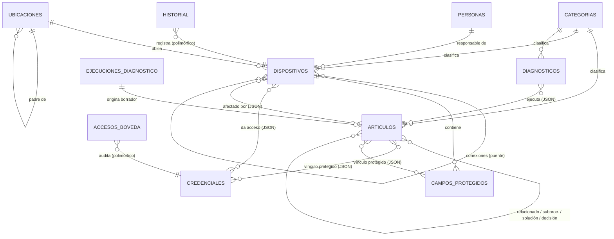
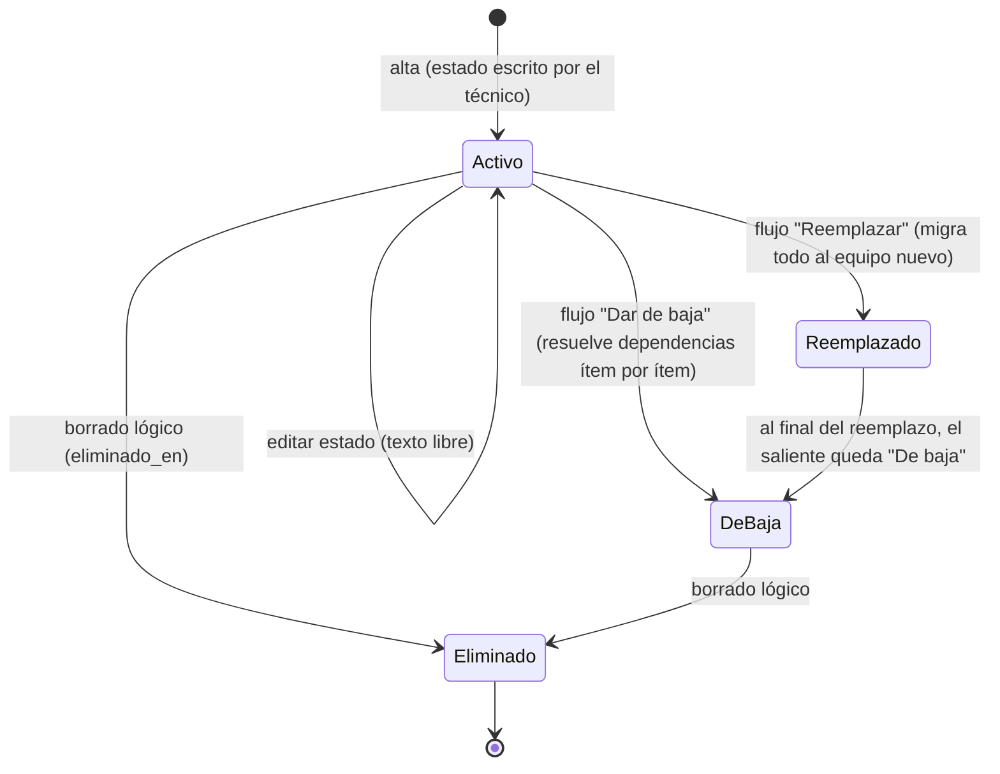
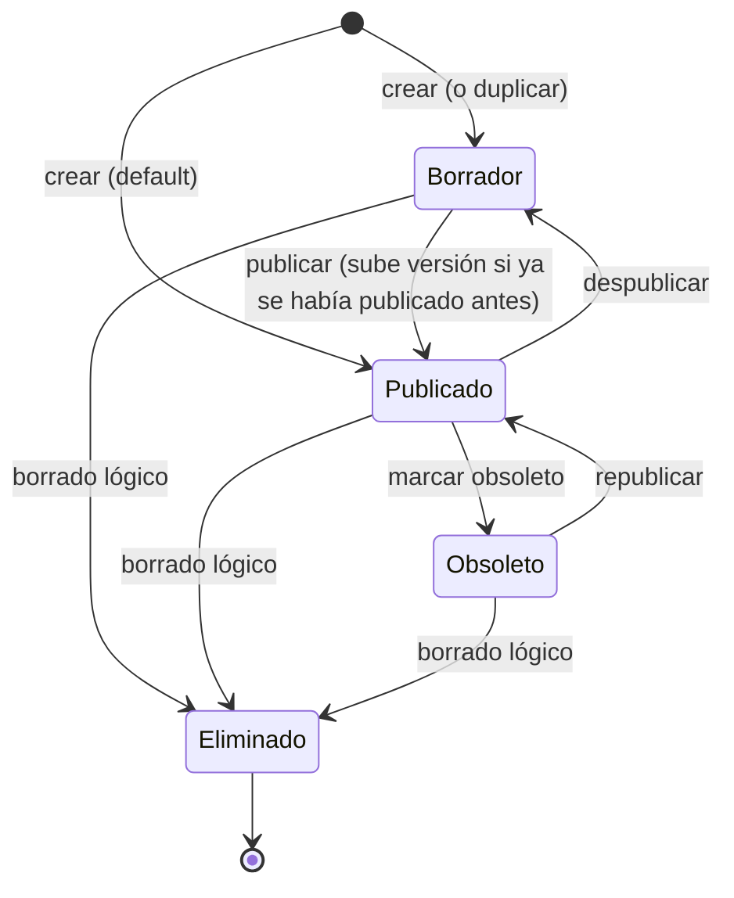
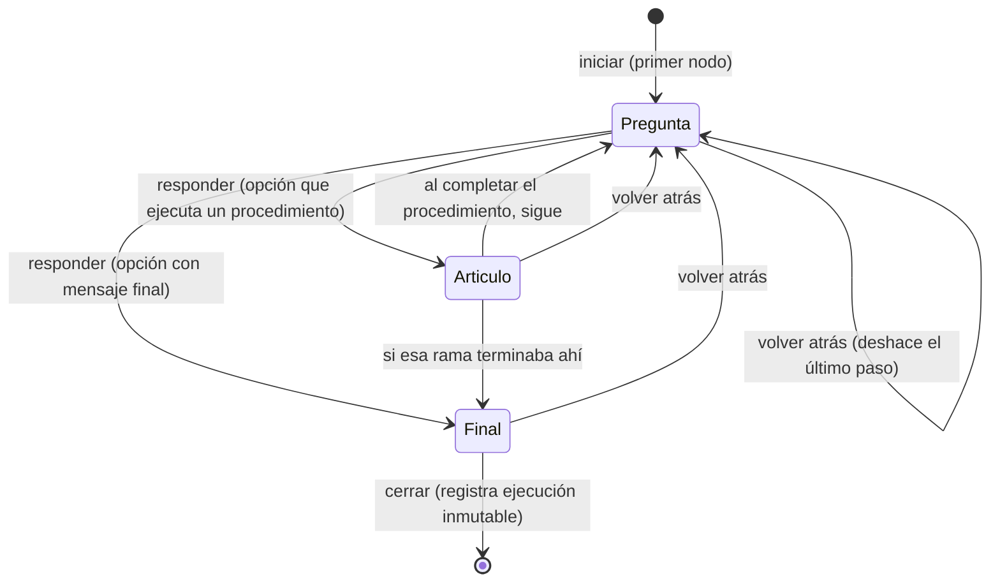
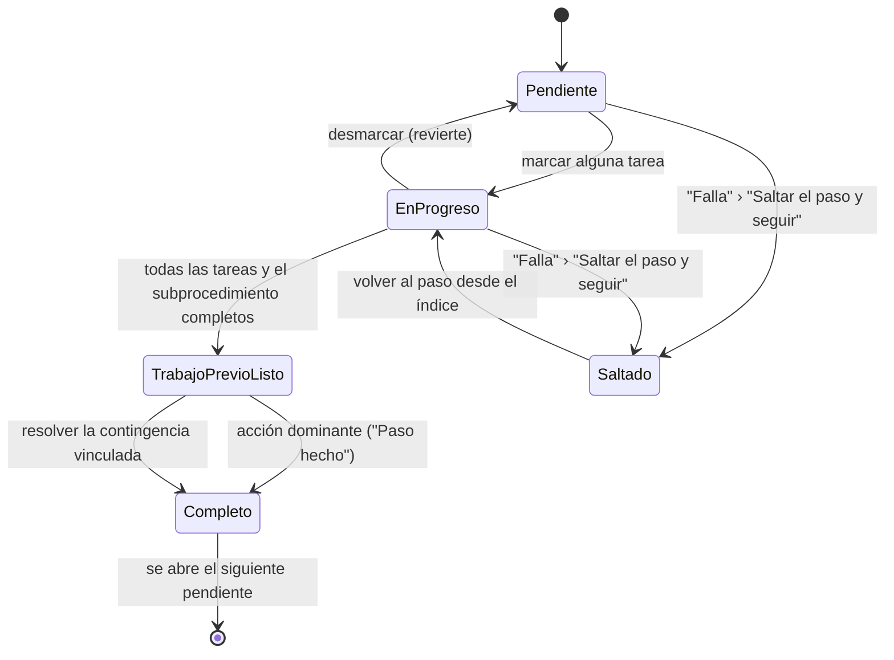
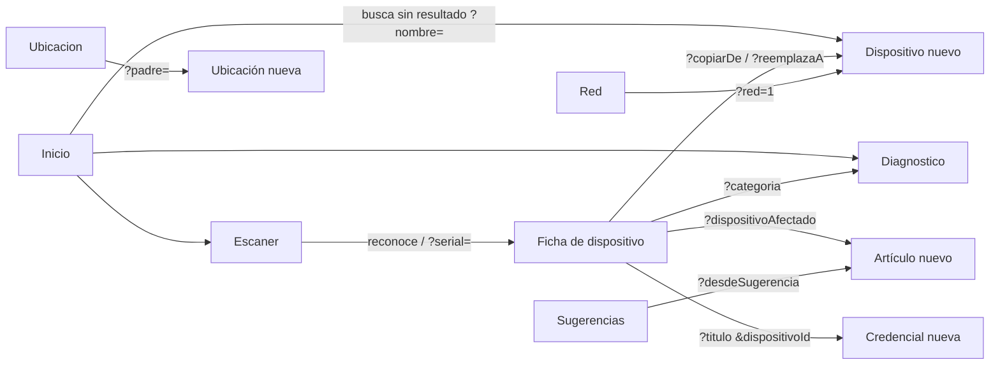

# Arquitectura funcional de Soluciones IT

Manual del comportamiento interno del sistema: reglas de negocio, permisos, ciclos de vida, eventos, dependencias, sincronización, auditoría, rendimiento, accesibilidad, navegación, modelo entidad-relación, convenciones y roadmap.

Este documento complementa a los demás, no los repite. Cada concepto vive en un solo lugar:

| Si buscas... | Está en |
|---|---|
| Stack y decisiones técnicas de implementación | [ARQUITECTURA.md](ARQUITECTURA.md) |
| Pantallas, formularios, botones y flujos del usuario | [DOCUMENTACION_FUNCIONAL.md](DOCUMENTACION_FUNCIONAL.md) |
| Componentes reutilizables (props, variantes) | [COMPONENTES_UI.md](COMPONENTES_UI.md) |
| El buscador en detalle | [BUSCADOR.md](BUSCADOR.md) |
| **Reglas de negocio, permisos, estados, eventos, dependencias, modelo E-R** | este documento |
| Decisiones de arquitectura (por qué) e historial | [DECISIONES.md](DECISIONES.md), [CHANGELOG.md](CHANGELOG.md) |

El código es la fuente de verdad. Todo lo que sigue se verificó contra `src/` y `supabase/schema.sql`; cuando el código y un documento previo discrepaban, se corrigió el documento (ver [CHANGELOG.md](CHANGELOG.md)).

## Índice

1. [Conceptos rectores](#1-conceptos-rectores)
2. [Catálogo de reglas de negocio (RN)](#2-catálogo-de-reglas-de-negocio-rn)
3. [Modelo entidad-relación](#3-modelo-entidad-relación)
4. [Ciclos de vida y máquinas de estado](#4-ciclos-de-vida-y-máquinas-de-estado)
5. [Modelo de permisos](#5-modelo-de-permisos)
6. [Eventos del sistema](#6-eventos-del-sistema)
7. [Dependencias entre entidades](#7-dependencias-entre-entidades)
8. [Arquitectura offline y sincronización](#8-arquitectura-offline-y-sincronización)
9. [Manejo de conflictos](#9-manejo-de-conflictos)
10. [Auditoría e inmutabilidad](#10-auditoría-e-inmutabilidad)
11. [Arquitectura de navegación](#11-arquitectura-de-navegación)
12. [Objetivos de rendimiento](#12-objetivos-de-rendimiento)
13. [Accesibilidad](#13-accesibilidad)
14. [Convenciones del proyecto](#14-convenciones-del-proyecto)
15. [Roadmap funcional](#15-roadmap-funcional)

---

## 1. Conceptos rectores

El principio rector del producto es **"cada dato existe una sola vez y todo lo demás lo referencia; nunca duplicar información"**. De ahí se derivan cuatro conceptos que aparecen en todo el sistema:

- **Copia de referencia:** un vínculo entre dos entidades guarda el `id` del otro extremo más una copia de su nombre o título. La copia es caché de presentación (permite mostrar el vínculo aunque la otra fila no haya sincronizado o ya no exista), nunca la fuente de verdad.
- **Referencia viva** (`src/lib/referencia.ts`): si la fila vive en la base local y no está eliminada, se muestra su dato actual; la copia congelada solo se usa cuando la fila falta o fue eliminada. Renombrar un equipo se refleja al instante en todas sus conexiones sin reescribir ninguna fila ajena.
- **Grafo derivado** (`src/lib/grafo.ts`): las relaciones N:M no se almacenan, se reconstruyen en memoria desde los datos locales, igual que el índice de búsqueda. Un grafo derivado no puede quedar desactualizado.
- **Registros inmutables:** `historial`, `ejecuciones_diagnostico` y `accesos_boveda` son solo inserción (append-only) y congelan sus textos a propósito, porque son fotos del pasado.

Detalle técnico de estos mecanismos en [ARQUITECTURA.md](ARQUITECTURA.md), sección 15.

---

## 2. Catálogo de reglas de negocio (RN)

Reglas atómicas que rigen el comportamiento del sistema. Cada una indica su motivo, las entidades involucradas y su impacto. "Dura" = impuesta por la base de datos; "blanda" = solo advertida en la interfaz.

### Integridad y unicidad

**RN-001. Todo dispositivo pertenece a exactamente una categoría.**
- Motivo: la sección Dispositivos/Red y la aplicabilidad de procedimientos parten de la categoría.
- Entidades: Dispositivo, Categoría. Dura (FK NOT NULL `dispositivos.categoria_id`).
- Impacto: no se puede crear un dispositivo sin categoría.

**RN-002. Todo artículo y todo diagnóstico pertenecen a exactamente una categoría.**
- Motivo: organizan la base de conocimiento y el Diagnóstico por categoría.
- Entidades: Artículo, Diagnóstico, Categoría. Dura (FK NOT NULL).
- Impacto: no existe contenido "sin categoría".

**RN-003. El nombre de categoría es único en todo el sistema.**
- Motivo: evitar categorías duplicadas que fragmenten el contenido.
- Entidades: Categoría. Dura (única restricción `UNIQUE` de todo el esquema).
- Impacto: la base rechaza dos categorías con el mismo nombre.

**RN-004. El serial de dispositivo se advierte como único, pero no se impone.**
- Motivo: evitar duplicados por descuido sin bloquear casos legítimos (equipos sin serial, migraciones).
- Entidades: Dispositivo. Blanda (aviso en `DispositivoForm` con enlace al duplicado).
- Impacto: dos equipos pueden coexistir con el mismo serial; el sistema solo avisa.

**RN-005. La IP de dispositivo se advierte como única, pero no se impone.**
- Motivo y mecanismo idénticos a RN-004.
- Entidades: Dispositivo. Blanda.

**RN-006. El nombre de un campo protegido es único dentro de su equipo (solo validación de formulario).**
- Motivo: no repetir "Contraseña del panel" dos veces en el mismo equipo.
- Entidades: Campo protegido, Dispositivo. Blanda (validación en memoria, no constraint).
- Impacto: un conflicto de sincronización podría crear dos con el mismo nombre; la interfaz normal lo evita.

### Dato único y referencias

**RN-007. Ningún dato se duplica: todo vínculo se guarda por `id` más una copia de referencia.**
- Motivo: el principio rector del producto.
- Entidades: todas las que se referencian entre sí (dispositivosAfectados, relacionados, credenciales.dispositivos, vinculoProtegido, conexiones, etc.).
- Impacto: renombrar una entidad no obliga a reescribir las que la referencian.

**RN-008. La copia de referencia solo se usa si la fila real no está disponible (referencia viva).**
- Motivo: mostrar siempre el dato actual y degradar con gracia offline.
- Entidades: todas las de RN-007.
- Impacto: cero escrituras de propagación, cero conflictos por renombrado.

**RN-009. Los registros inmutables congelan sus textos y nunca resuelven en vivo.**
- Motivo: son fotos del pasado; resolver en vivo reescribiría la historia.
- Entidades: Historial, EjecucionDiagnostico, AccesoBoveda.
- Impacto: el historial muestra el nombre que la ficha tenía en ese momento, no el actual.

**RN-010. El grafo de referencias es derivado; no se almacena ni se sincroniza.**
- Motivo: un grafo derivado no puede quedar obsoleto ni necesita esquema nuevo.
- Entidades: Artículo, Dispositivo, Credencial, Diagnóstico, Campo protegido.
- Impacto: agregar un vínculo nuevo no requiere migración de datos.

### Ciclo de vida y borrado

**RN-011. Todo borrado desde la app es lógico (`eliminado_en`), nunca físico.**
- Motivo: recuperar datos, propagar la eliminación como UPDATE por Realtime y conservar el historial.
- Entidades: las 10 tablas editables. Excepción: `perfiles` se borra en cascada con la cuenta de `auth.users` (única cascada de borrado físico del esquema).
- Impacto: nada se pierde de forma irreversible desde la interfaz.

**RN-012. Las tres tablas de auditoría son solo inserción.**
- Motivo: son la base de confianza de la trazabilidad y de las estadísticas.
- Entidades: Historial, EjecucionDiagnostico, AccesoBoveda.
- Impacto: nunca se editan ni se eliminan desde la app.

**RN-013. Eliminar un dispositivo no arrastra sus dependencias; el flujo "Dar de baja" las resuelve ítem por ítem.**
- Motivo: evitar borrados en cascada silenciosos; el técnico decide qué hacer con cada conexión, credencial y campo protegido.
- Entidades: Dispositivo, Conexión, Credencial, Campo protegido.
- Impacto: un borrado directo deja referencias huérfanas (que la referencia viva degrada); "Dar de baja" las previene.

**RN-014. `reemplaza_a` se fija una sola vez al crear y nunca se limpia.**
- Motivo: es la bitácora permanente de qué equipo reemplazó a cuál.
- Entidades: Dispositivo (autorreferencia).
- Impacto: la ficha del equipo entrante siempre puede mostrar "Reemplaza a...".

**RN-015. Un campo protegido puede sobrevivir a su dispositivo.**
- Motivo: al dar de baja un equipo, el técnico puede conservar el dato sin dueño.
- Entidades: Campo protegido, Dispositivo (`dispositivo_id` nullable, sin FK).
- Impacto: existe la opción explícita "conservar sin equipo".

**RN-016. Un artículo en borrador u obsoleto se excluye del buscador global, rutas de inicio, vinculables y Diagnóstico, salvo para quien lo edita.**
- Motivo: no sugerir al equipo contenido que no es oficial.
- Entidades: Artículo.
- Impacto: los borradores propios sí aparecen en la pantalla de Soluciones de su autor.

**RN-017. La versión de un artículo solo sube al guardar un artículo que ya estaba publicado.**
- Motivo: editar un borrador repetidamente no debe inflar la versión.
- Entidades: Artículo (`version`, `estado`).
- Impacto: sube la menor por defecto, la mayor con "Cambio mayor"; duplicar reinicia a 1.0 y estado borrador.

**RN-018. Toda rama de un árbol de diagnóstico debe terminar en algo útil (mensaje final o artículo vinculado).**
- Motivo: ninguna respuesta del técnico debe llevar a un callejón sin salida.
- Entidades: Diagnóstico. Validada al guardar (junto con ausencia de ciclos y de preguntas inalcanzables).

**RN-027. Un artículo puede refinar su aplicabilidad dentro de su categoría por marca y/o modelo.**
- Motivo: distinguir "Impresora Zebra ZD230" de toda la categoría Impresoras (hallazgo H6).
- Entidades: Artículo (`aplica_a`), Dispositivo. Si marca y modelo están ambos presentes, deben coincidir los dos (AND); ausente significa toda la categoría.
- Impacto: no duplica el dato del equipo; compara en vivo texto libre normalizado.

**RN-028. Una conexión solo se crea o se elimina, nunca se edita.**
- Motivo: para corregir un puerto se quita y se vuelve a agregar; simplifica el historial.
- Entidades: Conexión.
- Impacto: no existe una operación "editar conexión"; su historial son altas y bajas.

**RN-029. El progreso de procedimientos y diagnósticos es local por técnico, nunca compartido.**
- Motivo: dos técnicos pueden ejecutar el mismo procedimiento a la vez sin pisarse.
- Entidades: progresoPasos, progresoDiagnostico (tablas locales).
- Impacto: cerrar la app o perder señal nunca pierde el avance, pero no se ve el avance de otro.

### Seguridad y permisos (resumen; detalle en la sección 5)

**RN-019. No existen roles con nombre; solo "técnico autenticado" y el permiso `puede_ver_boveda`.**

**RN-020. Solo `credenciales` y `campos_protegidos` están tras la RLS de bóveda; el resto del contenido es lectura y escritura para cualquier autenticado.**

**RN-021. La contraseña maestra es única para todo el equipo y autoriza las eliminaciones sensibles sin exigir `puede_ver_boveda` (desde 2026-07-17).**

**RN-022. Cinco eliminaciones son sensibles (exigen contraseña maestra): artículo, dispositivo, credencial, diagnóstico y campo protegido.**

**RN-023. Solo se cifra el valor secreto; los metadatos (vencimiento, nombre, tipo, vínculos) viajan en claro a propósito, para poder listar, avisar y vincular sin desbloquear la bóveda.**

**RN-024. Todo dato sensible nuevo debe vivir en una tabla con la RLS de bóveda, nunca en una columna de una tabla de lectura general.**

**RN-025. La administración de usuarios y el restablecimiento de la contraseña maestra son operaciones de infraestructura fuera de la app (panel de Supabase), no funcionalidades pendientes.**

**RN-026. No existe exportación de datos en la app; la única descarga es la plantilla CSV vacía de importación.**

### Esquema y despliegue

**RN-030. Toda columna que la app sincronice debe existir en `supabase/schema.sql`, y una columna en `camposOpcionales` nunca debe tener además un default.**
- Motivo: `aFilaRemota` emite todas las columnas declaradas; una columna faltante en el servidor hace que PostgREST rechace la fila entera y el cambio se reintente para siempre.
- Entidades: todas las sincronizadas. Verificada por la prueba automatizada `src/lib/esquema.test.ts`.
- Impacto: es la regla 17 de [REGLAS.md](REGLAS.md), con guardián automático.

---

## 3. Modelo entidad-relación

### 3.1 Diagrama



### 3.2 Tabla de relaciones y cardinalidades

| Origen | Relación | Destino | Cardinalidad | Cómo se representa |
|---|---|---|---|---|
| Categoría | clasifica | Artículo / Dispositivo / Diagnóstico | 1 : N | FK dura NOT NULL |
| Ubicación | ubica | Dispositivo | 1 : N | FK `ubicacion_id` (nullable) + copia `ubicacion` |
| Ubicación | jerarquía | Ubicación | 1 : N | FK `padre_id` (autorreferencia, opcional) |
| Persona | responsable | Dispositivo | 1 : N | FK `responsable_id` (nullable) + copia `responsable` |
| Dispositivo | reemplaza | Dispositivo | 1 : 0..1 | FK `reemplaza_a` (autorreferencia, fija una vez) |
| Dispositivo | contiene | Campo protegido | 1 : N | `dispositivo_id` (nullable, sin FK) |
| Dispositivo | conexión | Dispositivo | N : M | tabla puente `conexiones` (dos FK duras) con atributos |
| Credencial | da acceso | Dispositivo | N : M | JSON `credenciales.dispositivos` `{id,nombre}[]` |
| Artículo | afecta a | Dispositivo | N : M | JSON `dispositivos_afectados` `{id,nombre}[]` |
| Artículo | relacionado / subproc. / solución / decisión | Artículo | N : M | JSON dentro de `relacionados` y `procedimiento` |
| Diagnóstico | ejecuta | Artículo | N : M | JSON `nodos[].opciones[].articuloId` |
| Artículo (paso o tarea) | vínculo protegido | Credencial o Campo protegido | N : 1 | JSON `vinculoProtegido {tipo,id,titulo}` |
| EjecuciónDiagnóstico | origina | Artículo | 1 : 0..1 | `articulos.origen_sugerencia_id` (uuid sin FK) |

Notas:
- `conexiones` es una **tabla puente autorreferencial** dispositivo a dispositivo, con atributos propios (`tipo`, `puerto`, `medio`). El tipo `relacionado` no participa en la topología.
- `aplica_a` (marca/modelo) **no produce arista** en el grafo: es un filtro de texto libre comparado en vivo contra el propio dispositivo, no una referencia por id.
- **Ubicación y Persona quedan fuera del grafo derivado** (`grafo.ts` no las modela como nodo). Sus inversos ("equipos en este lugar", "equipos de esta persona") se resuelven con consultas directas filtradas, no con `resumenImpacto`. Consecuencia: eliminar una ubicación o persona con equipos apuntándola no muestra el aviso genérico de impacto.

### 3.3 Referencias sin FK (a propósito)

Por el modelo offline primero, varias referencias son "blandas" (uuid sin FK, para que una fila no se rechace por el estado de otra tabla que quizá aún no sincronizó): `campos_protegidos.dispositivo_id`, `historial.entidad_id` (polimórfico), `ejecuciones_diagnostico.diagnostico_id`, `accesos_boveda.credencial_id` (polimórfico), `articulos.origen_sugerencia_id`, `adjuntos.entidad_id` (polimórfico).

Catálogo de campos entidad por entidad (tipos, nulabilidad, defaults): [ARQUITECTURA.md](ARQUITECTURA.md), sección 5.

---

## 4. Ciclos de vida y máquinas de estado

Distinción importante: solo dos entidades tienen un campo de estado persistido (`Articulo.estado`, enum real; `Dispositivo.estado`, texto libre). Las demás tienen un ciclo de vida simple (alta, edición, borrado lógico). Además existen dos máquinas de estado de **ejecución** (diagnóstico y procedimiento) que viven en tablas locales.

### 4.1 Dispositivo

`estado` es **texto libre, sin CHECK en la base**. No es una máquina de estados formal: el formulario sugiere valores (`Operativo`, `En mantenimiento`, `Fuera de servicio`, `De baja`) pero acepta cualquier texto. El único valor con comportamiento especial es `De baja` (comparado sin distinguir mayúsculas). El ciclo de vida real lo dan dos flujos asistidos y el borrado lógico:



- **Dar de baja** exige resolver antes cada conexión (eliminar), credencial (desvincular o eliminar) y campo protegido (conservar sin equipo o eliminar); "Confirmar baja" solo se habilita sin dependencias vivas.
- **Reemplazar** crea un equipo nuevo con `reemplaza_a = idViejo`, migra conexiones, credenciales y campos, y al final pone el saliente en `De baja`. `reemplaza_a` nunca se limpia (RN-014).
- El borrado lógico (`eliminado_en`) es independiente del `estado`.

### 4.2 Artículo (procedimiento)

`estado` es un enum real: `borrador | publicado | obsoleto` (default `publicado`). No hay transiciones restringidas: el editor puede pasar de cualquier estado a cualquier otro.



Reglas asociadas: RN-016 (visibilidad), RN-017 (versión).

### 4.3 Credencial y Campo protegido

Sin máquina de estados. Ciclo: alta, edición, borrado lógico. Del vencimiento (`vence_en`) se **deriva** un estado en cada lectura (`vencida`, `proxima` dentro de 30 días, o ninguno); nada se escribe en la base por ese cálculo.

### 4.4 Conexión, Ubicación, Persona

- **Conexión:** ciclo binario, existe o no existe (RN-028). No se edita.
- **Ubicación y Persona:** alta, edición libre de nombre/notas (y padre en ubicaciones), borrado lógico. Cada una tiene una migración asistida idempotente que convierte texto libre histórico en filas de la entidad.

### 4.5 Máquina de estado: ejecución de un diagnóstico

Estado en `progresoDiagnostico` (local por técnico). Transiciones puras en `src/lib/diagnostico.ts`, compartidas por el asistente real y el modo prueba del editor.



Al cerrar (resuelto `si`/`no`/`abandonado`) se inserta una fila en `ejecuciones_diagnostico` (salvo un abandono sin ninguna respuesta) y se borra el progreso local.

### 4.6 Máquina de estado: ejecución de un procedimiento (modo asistente)

Estado en `progresoPasos` (local por técnico). Un paso es un contenedor de tareas.



**La contingencia dejó de ser un estado del paso (tarea 215).** Hasta entonces, un paso con solución de error vinculada pasaba por `PreguntaError` ("¿Ocurrió algún error durante este paso?") antes de poder completarse, y esa pregunta **solo existía con el trabajo previo ya completo**: si el paso fallaba no se podían marcar sus tareas, así que la salida no llegaba a ofrecerse nunca. Ahora la contingencia se abre desde el botón **"Falla"**, disponible en cualquier estado del paso, y lo que cambia con el trabajo previo es solo **qué ocurre al resolverla**: con todo marcado completa el paso y el avance sigue; con tareas pendientes se cierra y el técnico vuelve al paso, porque darlo por hecho se saltaría trabajo que nadie hizo.

**Y dejó de ser una pregunta también en la vista de lectura (tarea 206, regla R59 de [DECISIONES.md](DECISIONES.md) AD-032).** Ahí seguía viva "¿Ocurrió algún error durante este paso?" con dos botones, uno verde ("No, continuar") y uno ámbar ("Sí, ver la contingencia"). El verde **completaba el paso**, que es exactamente lo que ya hace la insignia numerada del paso, así que la pregunta pedía una respuesta que se podía deducir; y el ámbar del panel competía con el ámbar del aviso, el único que advierte de un riesgo real. La contingencia queda como una **fila más entre los vínculos del paso**, "Si esto falla", disponible siempre y sin depender del trabajo previo. Al resolverla se aplica la misma regla del asistente: completa el paso solo si no le quedaba trabajo pendiente.

**`Saltado` no se guarda**: se deduce de que el paso esté sin hacer y por detrás del actual (ver `estadoPasos.ts`). No toca el esquema.

**Cómo se presenta el paso es una preferencia persistida, no un estado de la ejecución (tarea 217).** La máquina de arriba no cambia: la unidad que se completa sigue siendo el paso, y las transiciones son las mismas se mire por dónde se mire. Lo que cambió es la vista por defecto. `preferenciasTecnico.modoEjecucion` vale `'foco'` (una tarea a la vez) mientras el técnico no elija otra cosa, y `'pasoEntero'` si la elige; vive en el dispositivo, fuera de `progresoPasos`, porque expresa **cómo trabaja** y no **por dónde va**. Tres consecuencias de regla:

- **Un paso sin tareas se ejecuta igual.** En la vista por tarea se presenta como una tarea única con el título del paso (`tareasParaFoco`), y su botón dominante completa el paso. La pseudo tarea lleva el id `paso:<id>` y **nunca se escribe en `instruccionesHechas`**: no hay bloque que marcar, así que el progreso guardado no cambia de forma.
- **La condición para completar no depende de la vista.** Es la misma `pasoTrabajoPrevioCompleto` en los dos casos: todas las tareas marcadas (o ninguna que marcar) y el subprocedimiento satisfecho. La vista por tarea solo ofrece la acción cuando ya no queda ninguna tarea sin hacer, y escribe encima la misma razón del bloqueo.
- **Declarar una falla muestra el paso entero sin cambiar la preferencia.** Es una excepción atada al id del paso, del mismo tipo que el aviso de falla: al pasar al siguiente deja de aplicar. Saltar un paso, en cambio, no cambia de vista.

El `vinculoProtegido` de un paso es puramente informativo: no participa en ninguna condición de completado. Los subprocedimientos se ejecutan inline solo en el nivel 0; más profundo se muestran como enlace.

---

## 5. Modelo de permisos

### 5.1 Actores

El sistema **no modela roles con nombre**. Existen tres actores:

1. **Anónimo:** sin acceso. Toda política RLS es `to authenticated` y la app exige sesión antes de mostrar cualquier pantalla.
2. **Técnico autenticado** (cualquiera de los 5): rol base. Único requisito para todo el contenido general (categorías, artículos incluido publicar, dispositivos, conexiones, adjuntos, diagnósticos, ubicaciones, personas, importación). Puede autorizar eliminaciones sensibles si conoce la contraseña maestra.
3. **Técnico con `puede_ver_boveda = true`** (subconjunto): además, leer y escribir credenciales y campos protegidos, el bucket `archivos_boveda`, el historial de esas entidades y `accesos_boveda`.

El **administrador de Supabase** no es un actor dentro de la app: es quien tiene acceso al panel del proyecto. Sus dos capacidades no delegables (RN-025): crear cuentas con su contraseña inicial y cambiar `perfiles.puede_ver_boveda` (y restablecer la contraseña maestra borrando `boveda_meta`). **No hay pantalla de administración de usuarios en la app.**

### 5.2 Matriz de permisos

Barrera real: **RLS** (Postgres, bloquea aunque se llame la API directo); **Maestra** (contraseña maestra); **UI** (solo un `if` en React); **Ninguna** (basta estar autenticado); **Fuera** (exige el panel de Supabase).

| Acción | Técnico | + `puede_ver_boveda` | Barrera real |
|---|:---:|:---:|---|
| Crear/editar artículo (y publicar/despublicar) | Sí | Sí | Ninguna (RLS `true`) |
| Eliminar artículo | Sí | Sí | Maestra |
| Crear/editar dispositivo | Sí | Sí | Ninguna |
| Eliminar dispositivo | Sí | Sí | Maestra |
| Importar dispositivos (carga masiva) | Sí | Sí | Ninguna |
| Administrar categorías | Sí | Sí | Ninguna (eliminar categoría no es sensible) |
| Crear/editar diagnóstico | Sí | Sí | Ninguna |
| Eliminar diagnóstico | Sí | Sí | Maestra |
| Editar/eliminar ubicación o persona | Sí | Sí | Ninguna (confirmación simple) |
| Acceder a la bóveda (leer/descifrar) | No | Sí | RLS + Maestra |
| Ver la pestaña/ruta Bóveda | No | Sí | RLS + UI |
| Crear/editar campo protegido | No | Sí | RLS + UI |
| Eliminar credencial o campo protegido | No | Sí | RLS + Maestra |
| Autorizar cualquier eliminación sensible | Sí (si conoce la maestra) | Sí | Solo Maestra |
| Crear el verificador de la maestra (una vez) | No | Sí | RLS (INSERT exige `puede_ver_boveda`) |
| Leer el verificador de la maestra | Sí | Sí | Ninguna (a propósito, autoriza eliminaciones) |
| Administrar usuarios / `puede_ver_boveda` | No | No | Fuera |
| Restablecer la contraseña maestra | No | No | Fuera |
| Exportar datos | No existe | No existe | N/A |
| Configurar el bloqueo de la app | Sí (cada quien el suyo) | Sí | Local al dispositivo |

### 5.3 Consecuencia de diseño

Como la contraseña maestra es única y la conoce todo el equipo (autoriza también las eliminaciones sensibles), **el cifrado ya no distingue quién puede ver un secreto y quién no; la RLS por `puede_ver_boveda` es la única barrera real** entre un técnico sin permiso y un secreto. De ahí RN-024.

Detalle del cifrado, verificador y bloqueo de la app en [ARQUITECTURA.md](ARQUITECTURA.md), secciones 8 y 14.

---

## 6. Eventos del sistema

Todo cambio de datos pasa por **un único punto de escritura**, `src/lib/repositorio.ts`. Dos funciones cubren casi todo, cada una dentro de una transacción Dexie:

- `guardarRegistro(tabla, entidad, motivo)`: escribe la fila local, calcula el historial campo por campo, encola la entidad y sus entradas de historial, y programa la sincronización.
- `eliminarRegistro(tabla, id, motivo)`: nunca borra; pone `eliminado_en` y encola igual (RN-011).

### 6.1 Cadena de efectos de una escritura

```
Guardar (crear/editar)
  -> escribir fila local (Dexie), con updatedAt/updatedBy nuevos
  -> calcular historial (diff campo por campo)
  -> encolar entidad en cambiosPendientes (se colapsa 1 fila por entidad)
  -> encolar cada entrada de historial
  -> programarSync (debounce 800 ms)
       -> subir archivos pendientes primero, luego la cola de filas
       -> Realtime avisa a los demás -> disparan su propia descarga (respeta RLS)
       -> el índice de búsqueda y el grafo se reconstruyen solos (useLiveQuery)
```

El índice de búsqueda, el grafo de referencias y los avisos de impacto **no** son un paso del guardado: se derivan en memoria y se recalculan solos cuando cambian los datos locales.

### 6.2 Reglas por operación

| Operación | Efectos |
|---|---|
| Crear/editar dispositivo, artículo, diagnóstico, ubicación, persona | Un `guardarRegistro`. Historial: 1 entrada al crear, N al editar N campos. |
| Duplicar / Reemplazar equipo | Es "crear dispositivo" con id nuevo; `?copiarDe` precarga, `?reemplazaA` graba `reemplaza_a`. |
| Reemplazar (migración) | Secuencia (no atómica) que reapunta conexiones, credenciales y campos al nuevo, y al final pone el viejo en `De baja`. Un cierre a medias deja estado parcial pero seguro (se recalcula al reabrir). |
| Dar de baja | El técnico resuelve cada dependencia; "Confirmar baja" hace un `guardarRegistro` con `estado='De baja'`. |
| Ejecutar un diagnóstico | No toca la tabla `diagnosticos`. Al cerrar, inserta una fila inmutable en `ejecuciones_diagnostico` (salvo abandono sin respuestas). |
| Guardar credencial / campo protegido | `guardarRegistro`. Al **editar** o **eliminar** (y al consultar/copiar/mostrar/descargar) escribe además una fila en `accesos_boveda`. Al **crear** no (ya queda en el historial). |
| Registrar intervención (nota manual) | No toca la fila del dispositivo; crea directamente una entrada de historial y devuelve su id para colgarle una foto. |
| Crear/eliminar conexión | Genera **dos** entradas de historial, una por cada extremo. |
| Importar dispositivos | Recorre las filas en secuencia; cada una pasa por el camino normal completo; un fallo no aborta el resto. |
| Adjuntar un archivo | El archivo va por una cola propia y sube **antes** que la fila que lo referencia. |

Casos especiales del historial: `ubicacion_id`/`responsable_id`/`reemplaza_a` no generan entrada (su copia legible ya lo cubre); el historial de un campo protegido cuelga del propio campo, nunca del dispositivo (para que la RLS lo restrinja).

---

## 7. Dependencias entre entidades

El grafo derivado (`src/lib/grafo.ts`) modela 5 tipos de nodo (`articulo`, `dispositivo`, `credencial`, `diagnostico`, `campo_protegido`) y 14 tipos de arista. De él se derivan:

- **`referenciasHacia`**: el inverso universal "quién usa esto".
- **`resumenImpacto`**: la frase "Se usa en 3 procedimientos, 1 diagnóstico y 2 conexiones" que `DialogoEliminar` muestra en ámbar **antes** de confirmar (en artículo, dispositivo, credencial y campo protegido). Nada bloquea la eliminación: deja de ser a ciegas.

### 7.1 Qué pasa al eliminar o reemplazar

```
Eliminar un dispositivo (directo)
  -> soft-delete de la fila
  -> conexiones, credenciales y campos protegidos NO se tocan (quedan huérfanos)
  -> la referencia viva muestra su nombre desde la copia congelada
  -> resumenImpacto avisa antes, pero no resuelve nada

Dar de baja (flujo asistido)
  -> obliga a resolver cada conexión, credencial y campo protegido ANTES
  -> previene el huerfanaje

Reemplazar (flujo asistido)
  -> mueve todo junto al equipo entrante
  -> el saliente queda "De baja"
```

### 7.2 Ubicación y persona: mecanismo aparte

No son nodos del grafo. Eliminar una ubicación o persona **no reasigna ni bloquea nada**: los dispositivos conservan su `ubicacion_id`/`responsable_id` (ahora huérfano) y su copia de texto sigue mostrándose. Cada pantalla calcula su propio aviso contando a mano los equipos afectados, no con `resumenImpacto`.

---

## 8. Arquitectura offline y sincronización

Vista funcional; el mecanismo técnico (motor de sync, canal de Realtime, cursores) está en [ARQUITECTURA.md](ARQUITECTURA.md), sección 7.

### 8.1 Garantías funcionales

- **Offline primero:** lecturas y escrituras van siempre primero a la base local (Dexie); la app nunca espera a la red.
- **Cola de salida (outbox):** cada edición sin conexión se guarda y se envía sola al reconectar. Los archivos suben antes que las filas que los referencian.
- **Sincronización bidireccional:** se suben los cambios pendientes y se descargan las novedades del equipo por cursor de tiempo.
- **Tiempo real como señal:** un canal de Supabase Realtime avisa que algo cambió y dispara una descarga que respeta la RLS por consulta; nunca aplica el dato del evento (así nadie recibe un secreto que no debe ver). El sondeo cada 2 minutos es la red de seguridad.
- **Progreso local:** el avance de procedimientos y diagnósticos vive solo en el dispositivo (RN-029).

### 8.2 Qué es local y qué se sincroniza

- **Sincronizadas (13 tablas)** por el motor genérico, más `perfiles` y `boveda_meta` con un mecanismo propio de un solo sentido.
- **Locales puras (8):** `syncMeta` (cursores), `cambiosPendientes` (cola), `archivosPendientes` (cola de archivos), `seguridadApp` (bloqueo del dispositivo), `progresoDiagnostico`, `progresoPasos`, `recientes`, `favoritos`.

---

## 9. Manejo de conflictos

Cuando dos técnicos editan la misma fila (artículo, dispositivo, credencial, diagnóstico):

- **Gana la última escritura, por fila completa** (no por campo). No hay fusión campo a campo.
- **El historial conserva ambos cambios**, así que ningún dato se pierde de forma irrecuperable.
- **El conflicto se detecta y se avisa, sin bloquear:** cada cambio pendiente guarda el `updated_at` del servidor sobre el que partió; al subirlo, si el servidor ya tiene algo más nuevo, el panel de sincronización avisa qué ficha se sobrescribió (se sube igual).
- **Regla anti pisado:** una descarga nunca pisa una fila que tenga un cambio local pendiente de subir (no se pierde una edición offline a medio subir).

En la práctica, como cada dato vive una sola vez y los vínculos se resuelven por referencia viva, los conflictos reales son raros: renombrar una entidad no genera escrituras en las que la referencian.

---

## 10. Auditoría e inmutabilidad

### 10.1 Qué genera qué

- **Historial** (`historial`): toda creación, edición y eliminación de las 10 entidades editables, más las conexiones (una entrada por extremo) y las intervenciones manuales. Guarda usuario, fecha, campo, valor anterior y nuevo, y motivo opcional. Los valores cifrados nunca entran en claro: se guardan como `"(cifrado)"`.
- **Ejecuciones de diagnóstico** (`ejecuciones_diagnostico`): cada corrida terminada o abandonada del asistente (camino, artículos ejecutados, resultado, duración, motivo).
- **Accesos de bóveda** (`accesos_boveda`): cada consulta, copia, muestra, modificación, eliminación o descarga de una credencial o campo protegido.

### 10.2 Qué es inmutable y qué es mutable

- **Inmutable (solo inserción, nunca se edita ni elimina):** las tres tablas de arriba (RN-012).
- **Mutable con borrado lógico:** las 10 tablas de contenido (`eliminado_en`, nunca DELETE físico; RN-011).
- **Nunca cambia por diseño:** los textos congelados de los registros inmutables (RN-009).

### 10.3 Naturaleza de la trazabilidad

La auditoría es de buena fe del equipo: se registra desde el cliente en el momento de la acción y no detiene a quien ya conoce la contraseña maestra. Existe una asimetría conocida (registrada como deuda técnica en [TAREAS.md](TAREAS.md)): la política de **lectura** del historial de secretos exige `puede_ver_boveda`, pero la de **inserción** no lo distingue.

---

## 11. Arquitectura de navegación

### 11.1 Fuente única de la jerarquía

El botón "Volver"/"Cancelar" es navegación "Up" (padre lógico declarado), no `history.back()`. `src/lib/navegacion.ts` (`padreDe`) es la única fuente de qué pantalla es superior a cuál. Regla: la creación y las fichas de contenido suben a la lista de su sección; la edición y el asistente suben a la ficha de la entidad. Único override en tiempo de ejecución: la ficha de un equipo de red vuelve a `/red` en vez de a `/dispositivos`.

### 11.2 Chasis de tres niveles

Un solo envoltorio de pantalla, `src/app/Chasis.tsx` (tarea 185), con `modo = seccion | documento | tarea`. Cada pantalla declara su nivel y ninguna inventa un cuarto (regla **R18**):

- **`seccion`**: raíz de una pila (las cinco pestañas más la Bóveda). Barra superior de tres ranuras y barra de pestañas.
- **`documento`**: algo que se lee o se recorre dentro de una sección. Fila de regreso y acciones propias; **conserva** la barra de pestañas.
- **`tarea`**: algo que se hace y de lo que se sale (editor, asistente, escáner, importador, migración). Es el único nivel sin barra de pestañas, y en su lugar pone una `BarraTarea` que dice qué se hace, sobre qué y a dónde se vuelve (regla **R19**).

El chasis reserva además el espacio inferior que la barra ocupa (regla **R22**), en una sola constante medida en el navegador; antes once pantallas escribían ese cálculo a mano. Hasta esta tarea convivían dos chasis (13 pantallas con navegación, 25 con un contenedor propio), y tres listas que se recorren durante minutos (Personas, Ubicaciones, Diagnósticos) habían quedado sin barra por aplicarles la regla de "pantalla enfocada" donde no correspondía. El mapa completo de las 44 rutas (path, componente, nivel, guard, padre) está en [DOCUMENTACION_FUNCIONAL.md](DOCUMENTACION_FUNCIONAL.md), sección 3; el contrato del componente, en [COMPONENTES_UI.md](COMPONENTES_UI.md) sección 2.0; las decisiones, en [DECISIONES.md](DECISIONES.md) AD-026 y AD-027.

Desde la tarea 186, los niveles `seccion` y `documento` montan además `BarraReanudar`: una barra flotante del procedimiento a medias más reciente (regla **R23**, un aviso solo si hay un dato detrás), que se descarta deslizando o con su botón "X" y deja un punto en la pestaña Guías mientras el descarte siga vigente. Detalle del componente en [COMPONENTES_UI.md](COMPONENTES_UI.md) sección 2.10i.

Desde la tarea 187 el chasis suma cuatro comportamientos dinámicos, todos calculados en un solo sitio porque es el único envoltorio de todas las pantallas:

- **Dirección del movimiento (regla R21).** `src/app/direccionTransicion.ts` compara la profundidad de la ruta anterior con la actual y devuelve `entra` (bajar un nivel), `vuelve` (subir) o `lateral` (entre raíces de pestaña, aunque `/` y `/soluciones` tengan distinta cantidad de segmentos). El chasis lo publica como `data-transicion` y los keyframes viven en `src/index.css`, anulados en bloque bajo `prefers-reduced-motion`. La memoria de la última navegación se indexa por `location.key`, no por número de renders, para ser correcta bajo `StrictMode`.
- **Memoria por pestaña (regla R20).** Dos módulos: `memoriaScroll.ts` guarda la posición por ruta y la restaura al montar; `memoriaPestana.ts` guarda la cadena de búsqueda (los filtros) por raíz de pestaña y el enlace de la pestaña la repone al volver. Solo se recuerda la búsqueda de la **raíz**, nunca la de una ficha interna: los filtros son de la lista. Como corolario, el filtro tiene que existir en la URL para poder recordarse, así que `SolucionesPage` pasó de leerlo como semilla a escribirlo también (con `replace`, para no ensuciar el historial).
- **Avisos solo con dato detrás (regla R23).** El punto de Guías sale de `useReanudar()` y el número de Más de `usePendientes()`, el conteo real y no los seis que Inicio muestra.
- **Tocar la pestaña activa** en su raíz pelada sube al principio de la lista; con un filtro puesto, o desde una ficha interna, primero vuelve a la raíz.

Desde la tarea 191 el chasis define además los **cuatro puntos de quiebre** de la app, con una composición completa en cada uno (regla **R30**): `<768` teléfono (columna de 448 y pestañas), `768` rail de iconos de 64 px sin pestañas, `1280` sidebar completa de 240, `1680` sidebar de 232 y hasta 1.294 px de contenido (322 de lista + 720 de documento + 252 de contexto, el presupuesto de las tres zonas que reparte la tarea 199). Se expresan con `md`, `xl` y un `3xl` propio declarado en `@theme`; `sm`, `lg` y `2xl` quedan libres para lo que reflujan las pantallas por dentro con container queries. El tope de la columna crece y nunca se estrecha. Antes los puntos eran los de Tailwind por defecto y solo el de 1024 cambiaba algo estructural, lo que dejaba huérfana la banda de 768 a 1023. Motivo y la trampa del punto de quiebre en px, en [DECISIONES.md](DECISIONES.md) AD-028.

### 11.3 Enlaces cruzados (mapa)

Dos pantallas son hubs. La creación contextual siempre viaja por query params (nunca por estado del router), para sobrevivir a una recarga.



---

## 12. Objetivos de rendimiento

El volumen objetivo del sistema es un equipo de 5 técnicos: **cientos** de artículos, dispositivos, credenciales y diagnósticos, no miles. Los objetivos siguientes describen las metas de la aplicación; los marcados como "verificado" ya se cumplen en el código, los demás son objetivos de diseño a preservar.

| Aspecto | Objetivo | Estado |
|---|---|---|
| Búsqueda global | Respuesta en milisegundos, 100% local, sin red | Verificado (índice en memoria) |
| Apertura de una ficha | Instantánea offline (lectura directa de Dexie) | Verificado |
| Apertura de la app en frío | Menos de 1 segundo desde el ícono, incluso sin señal | Objetivo (PWA precacheada) |
| Latencia entre dispositivos | 1 a 2 segundos con Realtime; hasta 2 minutos con solo sondeo | Verificado |
| Reconstrucción del índice de búsqueda | Sub-frame para el volumen del equipo | Verificado; riesgo si el volumen crece mucho (es total, no incremental) |
| Volumen esperado | Cientos por entidad | Objetivo de diseño |
| Tamaño de imágenes | Comprimidas al subir para aprovechar el 1 GB gratuito de Storage | Verificado (compresión + deduplicación por hash) |

Riesgo registrado en [TAREAS.md](TAREAS.md): el índice de búsqueda y el grafo se reconstruyen completos ante cualquier cambio; la frecuencia (no el volumen) es el límite si el equipo crece.

---

## 13. Accesibilidad

Estado actual verificado en el código y objetivos a mantener:

- **Tema:** oscuro único (decisión de diseño). Contraste mínimo medido en el sistema de color por categoría: 7.53:1 (supera holgadamente AA 4.5:1).
- **Responsive:** la columna de contenido crece por tramos (móvil a escritorio) con container queries; las tablets dejan de recibir la interfaz de teléfono. Objetivo: ningún desbordamiento horizontal del cuerpo.
- **Áreas táctiles:** los controles de icono son cuadrados de 34x34 px (`BTN_ICONO_*`); los objetivos táctiles de listas y pestañas se dimensionan para el uso con el teléfono en mano.
- **Teclado:** los modales se cierran con Escape; los formularios son campos nativos (`<input>`, `<select>`, `<textarea>`) navegables con Tab.
- **Lectores de pantalla:** los iconos llevan `aria-hidden` por defecto (son decorativos junto a texto); los modales usan `tituloId` para asociar su título.

Objetivos a preservar al agregar pantallas: mantener el contraste AA, no introducir desbordamiento horizontal, conservar el foco navegable por teclado y no depender solo del color para transmitir estado (los estados llevan además etiqueta e icono).

Mejoras de accesibilidad pendientes se registran en [TAREAS.md](TAREAS.md).

---

## 14. Convenciones del proyecto

### Organización

```
src/
  app/          chasis global (Chasis)
  features/<dominio>/   pantallas y lógica de cada dominio
  lib/          lógica pura y acceso a datos (sin JSX)
  components/   componentes compartidos entre dominios
  pruebas/      helpers de test
supabase/
  schema.sql    esquema de tablas y políticas RLS
```

Dominios de `features/`: autenticacion, boveda, busqueda, diagnostico, dispositivos, escaner, historial, inicio, personas, red, seguridad, soluciones, ubicaciones.

### Nombres

- **Componentes React:** `PascalCase.tsx` (`DispositivoPage.tsx`, `BotonVolver.tsx`).
- **Lógica pura:** `camelCase.ts`, casi siempre con su `*.test.ts` al lado en la misma carpeta.
- **Hooks:** `useX.ts` (`usePerfilVivo.ts`, `useProcedimientoEjecucion.ts`); los realmente compartidos viven en `src/components`.
- **Rutas:** siempre en español y minúsculas, acordes al texto visible (`/soluciones`, `/dispositivos/nuevo`, `/boveda/migrar`).
- **Tablas remotas:** snake_case, español, plural (`campos_protegidos`, `ejecuciones_diagnostico`).
- **Datos:** camelCase en el cliente, snake_case en Supabase. La frontera se cruza solo en `src/lib/tablas.ts` (`aFilaRemota`/`aEntidadLocal`); el resto de la app nunca ve snake_case.
- **Identificadores en inglés, textos visibles en español** (REGLAS.md).

### Versionado

- **Esquema local (Dexie):** versionado incremental y solo aditivo (`this.version(1)` a `this.version(14)`).
- **Esquema remoto (`schema.sql`):** idempotente (`create table if not exists`, `alter table ... add column if not exists`), una sola ejecución cubre todos los grupos acumulados. RN-030 y su prueba lo protegen.
- **Versión de un artículo:** texto legible "1.0", calculado por `src/lib/version.ts` (RN-017).

### Diseño

Sistema visual Nocturne (tema oscuro único). Tres lenguajes de color que no se mezclan: **estado** de un equipo, **tipo** de documento e **identidad de categoría**. Nunca generar nombres de clase Tailwind en runtime (no los detecta). Detalle en [ARQUITECTURA.md](ARQUITECTURA.md) y [COMPONENTES_UI.md](COMPONENTES_UI.md).

---

## 15. Roadmap funcional

Solo funcionalidades realmente planeadas. El tablero vivo con prioridades y ubicaciones está en [TAREAS.md](TAREAS.md); esta sección da la vista por versiones.

### Estado actual (base consolidada)

La aplicación cumple hoy sus cuatro pilares (base de conocimiento, inventario, bóveda, búsqueda) con funcionamiento offline, sincronización en tiempo real, grafo de referencias, diagnóstico inteligente, topología de red y auditoría. La auditoría del flujo del técnico estima ~85% de cumplimiento del principio "cada dato una sola vez".

### Próximo (mejoras ya diagnosticadas, sin funcionalidad nueva "por agregar")

- Cerrar los huecos restantes del principio "cada dato una sola vez" (tareas 160 a 166 de la auditoría del flujo del técnico).
- Deuda de duplicación de UI: extraer el componente de estado (`IndicadorEstado`), unificar el "buscar o crear inline" y el desbloqueo inline de la bóveda (candidatos CAND-1 a CAND-6 de [COMPONENTES_UI.md](COMPONENTES_UI.md)).
- Buscador: pintar la miniatura de portada en los resultados (hoy se calcula pero no se muestra); unificar las tres normalizaciones de acentos; considerar un tope de resultados. Ver [BUSCADOR.md](BUSCADOR.md).
- Seguridad: cerrar la asimetría de la política de inserción del historial de secretos y decidir explícitamente el control de propietario del bucket `adjuntos`.

### Explícitamente fuera de alcance (no son pendientes)

- Administración de usuarios dentro de la app y restablecimiento de la contraseña maestra: son operaciones de infraestructura en Supabase por diseño (RN-025).
- Exportación de datos desde la app (RN-026).
- Modo claro o conmutador de tema (la app es de tema oscuro único por decisión de diseño).

Las propuestas funcionales de mayor alcance (base de conocimiento, jornada del técnico, módulos, seguridad de dispositivo, UX de diagnóstico) viven en los archivos `PROPUESTA_*.md`, en su mayoría ya implementadas; su estado se rastrea en [DECISIONES.md](DECISIONES.md).
