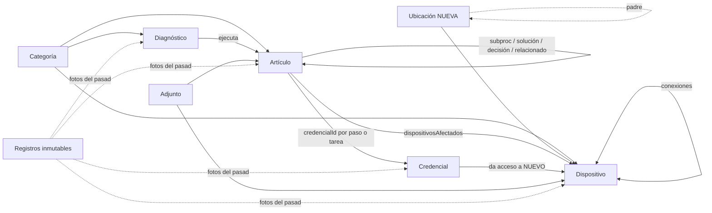

# Propuesta: base de conocimiento inteligente (de 9.5 a 10)

Fecha: 2026-07-15
Estado: PRESENTADA, pendiente de que el usuario decida fases y resuelva las decisiones abiertas (sección 12).

Origen: solicitud del usuario del 2026-07-15 (13 puntos de análisis: modelo de datos, relaciones, automatización, navegación, buscador, entidades, escalabilidad, UX, aprendizaje, infraestructura, mantenimiento, historial y vista 360°). Todo el análisis está hecho contra el código real, no contra suposiciones.

Principio rector acordado: **cada dato existe una sola vez y todo lo demás lo referencia. Nunca duplicar información.**

---

## 1. Diagnóstico honesto: la app ya cumple el principio en un ~80 %

Antes de proponer, hay que decir la verdad: la arquitectura actual ya es, en su mayor parte, la que esta propuesta pediría. No es casualidad: las propuestas anteriores ([PROPUESTA_UX_DIAGNOSTICO.md](PROPUESTA_UX_DIAGNOSTICO.md) y [PROPUESTA_MODULOS.md](PROPUESTA_MODULOS.md)) fueron empujando en esta dirección. Evidencia concreta:

| Principio | Cómo ya se cumple |
|---|---|
| Un dispositivo existe una sola vez | La sección Red NO duplica el inventario: usa los mismos `dispositivos` con la bandera `es_red` de su categoría. Una sola ficha (`/dispositivos/:id`) servida por ambas secciones. |
| Un procedimiento existe una sola vez | Subprocedimientos, soluciones de error y decisiones vinculan otro artículo por id (más copia del título); el paso a paso jamás se copia. Actualizar el subprocedimiento actualiza todos los que lo usan. El Diagnóstico Inteligente ejecuta artículos existentes, no los duplica. |
| Una credencial existe una sola vez | Los pasos y tareas guardan solo `credencialId` + título de referencia; los secretos nunca viajan en el artículo y se descifran bajo demanda con la contraseña maestra. |
| Una categoría existe una sola vez | Tabla `categorias` referenciada por artículos, dispositivos y diagnósticos. |
| Los archivos no se duplican | Duplicar un artículo comparte las referencias de Storage sin copiar archivos. Un mismo manual puede vivir en N pasos. |
| El historial no duplica | Registros inmutables solo-inserción (`historial`, `ejecuciones_diagnostico`, `accesos_boveda`) que referencian a la entidad. |
| Vista 360° | Ya existe para dispositivos (tarea 39 fase 1): Información, Procedimientos y diagnóstico, Problemas frecuentes, Conexiones, Impacto de falla, Depende de, Adjuntos, Historial. |
| Topología navegable | Rack → switch → AP → cámara ya es navegable en ambos sentidos (árbol de topología, "Depende de", "Contiene", "Instalado en"). |

Lo que separa a la app del 10 NO son funciones nuevas: son **cuatro grietas estructurales** donde el principio todavía se rompe. Toda esta propuesta se reduce a cerrarlas y a estandarizar los patrones que ya demostraron funcionar.

### Grieta 1: la ubicación es texto libre (la última gran duplicación)

`dispositivos.ubicacion` es un `<input>` de texto sin siquiera autocompletar (`DispositivoForm.tsx:235`). "Taquilla Norte", "taquilla norte" y "Taq. Norte" son hoy tres ubicaciones distintas. La ubicación también se escribe a mano dentro de credenciales y artículos. Es exactamente el problema que `categorias` resolvió para la clasificación, sin resolver para el lugar físico.

### Grieta 2: las copias de referencia no tienen regla de frescura

El patrón "id + copia del título" es correcto (offline primero: la copia permite mostrar el vínculo aunque la otra fila no haya sincronizado). Pero la app es inconsistente en QUÉ muestra cuando la fila SÍ está local:

- `CredencialEnPaso.tsx:47` lo hace bien: título vivo si la credencial existe, copia solo como respaldo.
- `PasosEditor.tsx:818,915,973` lo hace bien (`vinculado?.titulo ?? copia`).
- `lib/conexiones.ts:22-25` lo hace mal: la ficha y la topología muestran `origenNombre`/`destinoNombre` congelados. Renombrar un switch deja TODAS sus conexiones mostrando el nombre viejo.
- `ProcedimientoVista.tsx:156` y `AsistenteVista.tsx:170` usan la copia del subprocedimiento como título del paso sin resolverla en vivo.

Sin una regla única, cada pantalla nueva decide sola y el "cuando algo cambie, todas las referencias se actualizan" del principio queda al azar.

### Grieta 3: no existe el inverso universal "¿qué referencia a esto?"

Los inversos existen pero uno por uno, como casos ad hoc: `problemasDeDispositivo` (incidencias del equipo), "aparece como relacionado en" (`ArticuloPage.tsx`), impacto de falla (red). Faltan todos los demás: ¿qué procedimientos usan esta credencial? ¿Qué pasos vinculan este artículo como subprocedimiento? ¿Qué diagnósticos lo ejecutan? Hoy eliminar un artículo NO avisa que 3 procedimientos y 1 diagnóstico lo referencian; el técnico lo descubre después, al encontrarse el vínculo roto.

### Grieta 4: enlaces que faltan en la matriz de relaciones

Credencial ↔ dispositivo y artículo ↔ dispositivo concreto (más allá de la categoría y de las incidencias) no existen. Es la tarea 39 fase 2, ya identificada. También falta relacionar dos equipos que no son de red (un POS con su impresora): el tipo 'relacionado' de `conexiones` quedó fuera del grupo de esquema anterior.

---

## 2. El principio rector, refinado con dos matices de ingeniería

Para que "nunca duplicar" sea aplicable sin ambigüedad, se formaliza así:

1. **Dato canónico**: cada hecho (el nombre de un equipo, el paso a paso de un procedimiento, un secreto) vive en UNA fila de UNA tabla. Todo lo demás guarda su id.
2. **Copia de referencia = caché de presentación, no dato**. Guardar el título junto al id es legítimo (offline primero), pero con una regla de frescura obligatoria: **si la fila vive en la base local, se muestra el dato vivo; la copia guardada es solo el respaldo** para cuando la fila no sincronizó o fue eliminada. Esta regla se aplica en el 100 % de las vistas (hoy es inconsistente, ver grieta 2).
3. **Los registros inmutables copian a propósito y NO se actualizan jamás**: `historial`, `ejecuciones_diagnostico` y `accesos_boveda` guardan textos congelados porque son fotos del pasado. "Resolver en vivo" ahí sería un error: reescribiría la historia (una ejecución de 2026 debe mostrar la pregunta tal como era en 2026). Esta exención es deliberada y se documenta.

---

## 3. Arquitectura de entidades objetivo (punto 6 del pedido)

Catálogo completo. Solo UNA entidad es nueva (Ubicación); el resto ya existe y se conserva:

| Entidad | Tabla | Atributos clave | Estado |
|---|---|---|---|
| Categoría | `categorias` | nombre, icono, orden, es_red | Existe |
| Artículo (procedimiento, manual, incidencia) | `articulos` | titulo, tipo, estado, version, contenido, procedimiento (JSON: pasos, bloques, vínculos), sintomas/causas, dispositivosAfectados, relacionados, etiquetas, es_ruta_inicio | Existe |
| Diagnóstico | `diagnosticos` | titulo, categoria, nodos (árbol de preguntas con vínculos a artículos) | Existe |
| Dispositivo | `dispositivos` | nombre, marca, modelo, serial, placa, **ubicacion_id (nuevo)**, ip, estado, detalles (clave/valor libre), foto | Existe, cambia ubicación |
| Conexión | `conexiones` | tipo (enlace, instalacion, **relacionado (nuevo)**), origen/destino + puertos, medio | Existe, suma un tipo |
| Credencial | `credenciales` | titulo, categoria, datos_cifrados, vence_en, **dispositivos vinculados (nuevo)** | Existe, suma vínculo |
| **Ubicación (NUEVA)** | `ubicaciones` | nombre, padre_id (jerarquía opcional: sede > área), notas | No existe |
| Adjunto | `adjuntos` + `PasoAdjunto` inline | entidad dueña, nombre, tipo, referencia de Storage | Existe |
| Etiqueta | NO es tabla | Vocabulario derivado de las etiquetas existentes (ver sección 7) | Existe como texto |
| Registros inmutables | `historial`, `ejecuciones_diagnostico`, `accesos_boveda` | solo inserción, cursor recibido_en | Existen |
| Perfil | `perfiles` | nombre, correo, puede_ver_boveda | Existe |

Decisión explícita: **Etiqueta y Puerto NO se convierten en entidades**. Las etiquetas como tabla exigirían gestión (crear, renombrar, fusionar) que un equipo de 5 no va a mantener; el vocabulario derivado con autocompletar da el 95 % del beneficio con cero mantenimiento. Los puertos son atributos de una conexión (`origenPuerto`), no objetos con vida propia; modelarlos aparte es nivel CMDB corporativa y multiplicaría el trabajo de captura sin cambiar ninguna respuesta que la app pueda dar.

### Matriz de relaciones completa (punto 2 del pedido)

| De \ hacia | Categoría | Ubicación | Dispositivo | Artículo | Diagnóstico | Credencial | Adjunto |
|---|---|---|---|---|---|---|---|
| **Dispositivo** | categoria_id | ubicacion_id (N3) | conexiones (enlace, instalacion, relacionado N3) | inverso de dispositivosAfectados | por categoría (botón ya existe) | inverso del vínculo credencial→dispositivo (N3) | entidad_tipo + foto |
| **Artículo** | categoria_id | (por sus dispositivos) | dispositivosAfectados (se generaliza a todo tipo, N2) | subprocedimiento, solución, decisión, relacionados | inverso: "lo ejecutan N diagnósticos" (N1) | credencialId por paso y por tarea | galería por paso + portada + tabla adjuntos |
| **Diagnóstico** | categoria_id | - | (por su categoría) | opciones que ejecutan artículos | - | (vía los artículos) | - |
| **Credencial** | texto con vocabulario derivado | (texto dentro del cifrado, opcional ubicacion_id futuro) | dispositivos vinculados (N3) | inverso: "usada en N procedimientos" (N1) | - | - | - |
| **Ubicación (nueva)** | - | padre_id (jerarquía) | inverso: "equipos en este lugar" | - | - | - | - |

Todo lo marcado "inverso" NO se guarda: se calcula localmente (sección 4). Solo se almacena la arista en una dirección, la otra se deriva. Eso elimina de raíz la posibilidad de que las dos direcciones queden desincronizadas.

---

## 4. La pieza central nueva: el grafo de referencias derivado (puntos 2, 4, 11, 13)

**Qué es**: una función pura (`src/lib/grafo.ts`) que recorre los datos locales y produce la lista de aristas tipadas del sistema: `{origenTipo, origenId, destinoTipo, destinoId, relacion, contexto}`. Fuentes: los vínculos dentro del JSON `procedimiento` (credencial, subprocedimiento, solución, decisión, por paso y por bloque), `dispositivosAfectados`, `relacionados`, las opciones de los `diagnosticos` que ejecutan artículos, `conexiones`, `adjuntos` y (N3) los vínculos de credenciales y ubicaciones.

**Por qué derivado y no almacenado**: es la decisión arquitectónica más importante de esta propuesta. Una tabla de relaciones almacenada habría que mantenerla sincronizada con cada edición (más filas en la outbox, más conflictos, y la posibilidad permanente de que grafo y datos discrepen). Derivado, el grafo **no puede estar desactualizado**: se reconstruye de los datos locales igual que el índice MiniSearch (mismo patrón, misma escala, milisegundos para un equipo de 5). Cero cambios de esquema, cero sincronización nueva, testeable con pruebas unitarias puras.

**Qué habilita, en orden de valor**:

1. **"Referenciado por" en toda ficha** (el inverso universal, grieta 3): la ficha de una credencial lista los procedimientos que la usan; la de un artículo, los procedimientos que lo vinculan como subprocedimiento o solución y los diagnósticos que lo ejecutan; la de un dispositivo ya tiene sus inversos y se completa. Es la generalización de `problemasDeDispositivo` (que quedaría como el primer caso particular del grafo).
2. **Impacto antes de eliminar**: `DialogoEliminar` consulta el grafo y muestra "Este artículo se usa en 3 procedimientos y 1 diagnóstico" ANTES de confirmar. Hoy la eliminación es a ciegas y el equipo descubre los vínculos rotos después. (Los vínculos rotos ya se degradan con gracia gracias a las copias de referencia; esto los previene en vez de solo tolerarlos.)
3. **Navegación por relaciones sin volver al menú** (punto 4 del pedido): cada relación del grafo es un enlace a la ficha del otro extremo. Dispositivo → procedimiento → credencial → dispositivos que la usan → topología → historial, en cualquier orden y sentido.
4. **Vista 360° para TODAS las entidades** (punto 13): la ficha del dispositivo ya la tiene; con el grafo, artículo, credencial, categoría y ubicación la obtienen con el mismo esqueleto (sección 8).

---

## 5. Regla de referencia viva (puntos 2 y 11)

Utilidad única `tituloVivo(filaLocal, copiaGuardada)` (una línea de lógica, pero con nombre y pruebas: la regla queda escrita en el código) y corrección de los lugares que hoy muestran la copia congelada teniendo la fila local:

- `lib/conexiones.ts:22-25` (resumen de conexión) y las vistas de red que muestran `origenNombre`/`destinoNombre`: resolver contra `dispositivos` local. El árbol de topología ya usa los nombres vivos (`infoDeDispositivos`); esto empareja la ficha con el árbol.
- `ProcedimientoVista.tsx:156` y `AsistenteVista.tsx:170`: título del paso que cae al subprocedimiento.
- Etiquetas de opciones del diagnóstico que muestran `articuloTitulo`.
- Auditar `dispositivosAfectados` y `relacionados` en sus vistas (parte ya resuelve en vivo).

Con esto, renombrar cualquier cosa se refleja al instante en toda la app sin tocar ninguna fila ajena: **cero escrituras de propagación, cero conflictos de sincronización**. La alternativa (reescribir todas las copias al renombrar) generaría N ediciones + N entradas de historial + N conflictos potenciales por un solo renombre; se descarta explícitamente.

Exención documentada: los registros inmutables muestran siempre su copia congelada (sección 2, matiz 3).

---

## 6. Ubicaciones como entidad (punto 1) y los enlaces faltantes (grieta 4)

### Fase N0, inmediata y sin esquema: vocabulario derivado

Mientras se decide el esquema, `DispositivoForm` gana un `<datalist>` con las ubicaciones ya usadas (el mismo patrón que `CredencialForm.tsx:26-27` ya aplica a las categorías de la bóveda, y que debería aplicarse también a `marca`). Detiene HOY la proliferación de variantes ("Taquilla Norte" vs "taq. norte") a costo casi nulo.

### Fase N3, con esquema: tabla `ubicaciones`

- `ubicaciones`: id, nombre, padre_id (opcional, jerarquía simple de un nivel práctico: "Sede Norte" > "Taquilla 2"; sin límite duro, sin obligación de usarla), notas, updated_at, updated_by, eliminado_en. Historial con entidad_tipo 'ubicacion'.
- `dispositivos.ubicacion_id` (nullable) + la columna `ubicacion` actual se conserva como copia de referencia (regla de la sección 5, mismo patrón que todo lo demás).
- Migración asistida: pantalla única que lista los textos distintos existentes, propone crear una ubicación por cada uno y permite fusionarlos antes de confirmar (aquí se corrigen de una vez las variantes históricas).
- Efectos: ficha 360° de la ubicación ("qué hay en este lugar", derivada del grafo), grupo "Ubicaciones" en el buscador, filtro por ubicación real en Dispositivos y Red, y herencia al crear (sección 7).

### Credencial ↔ dispositivo (N3, con esquema)

Columna `dispositivos jsonb` en `credenciales` (lista `{id, nombre}`, patrón de copia de referencia). Se edita en el formulario de la credencial; la ficha del equipo muestra el inverso "Credenciales de este equipo" derivado del grafo, protegido igual que `CredencialEnPaso` (título visible, secretos solo con permiso + contraseña maestra). El vínculo NO viaja cifrado a propósito, como `vence_en`: qué credencial pertenece a qué equipo no es secreto, el secreto es su contenido; y así el inverso funciona sin desbloquear la bóveda.

### Artículo ↔ dispositivo concreto (N2, SIN esquema)

`dispositivosAfectados` ya acepta datos en cualquier tipo de artículo sin romper nada (diseño de la tarea 38). Se generaliza su edición a todos los tipos con etiqueta según el tipo ("Dispositivos afectados" en una incidencia, "Equipos donde aplica" en el resto). La ficha del dispositivo ya muestra el inverso para incidencias (`problemasDeDispositivo`); se amplía a "Procedimientos de este equipo". Cero columnas nuevas: la tarea 39 fase 2 se encoge.

### Conexiones entre equipos que no son de red (N3, esquema mínimo)

Tipo 'relacionado' en el check constraint de `conexiones` (sin puertos ni medio): "este POS trabaja con esta impresora". Aparece en las fichas de ambos, no en la topología (no es dependencia de servicio).

---

## 7. Automatización (punto 3): que nada se escriba dos veces

Ya existen y se conservan: plantillas por tipo de artículo, aviso anti duplicados por título, sugerencia de vincular un procedimiento existente al titular un paso, versión automática, estado por defecto, duplicar artículo/dispositivo/pregunta, importación masiva CSV, compresión automática de fotos.

Se agregan, todas derivadas de datos existentes (cero esquema, cero configuración que mantener):

1. **Creación contextual con herencia**: crear una entidad DESDE la ficha de otra precarga la relación y los datos compartidos. "+ Equipo" desde una ubicación precarga la ubicación; "+ Conexión" desde un switch precarga el origen (ya funciona así en `ConexionesFicha`); "+ Credencial" desde un equipo precarga el vínculo; "+ Incidencia" desde un equipo precarga categoría y dispositivo afectado. Regla general: **ningún dato visible en la pantalla de origen se vuelve a escribir en el formulario de destino.**
2. **Propiedades sugeridas por categoría**: al agregar una propiedad personalizada a un dispositivo, autocompletar la CLAVE con las claves que los dispositivos de esa misma categoría ya usan (si 30 cámaras tienen "puerto" y "switch", la cámara 31 las recibe como sugerencia con un toque). Es la plantilla por categoría que el usuario pidió en su día, pero **aprendida del uso real en vez de configurada**: respeta la decisión deliberada de no tener plantillas rígidas y no exige mantenimiento cuando aparece una categoría nueva.
3. **Vocabularios derivados en todo texto repetido**: ubicación y marca de dispositivos (N0), etiquetas de artículos (autocompletar con las existentes, frena la fragmentación "impresora"/"impresoras"), categoría de credencial (ya lo hace).
4. **Herencia en cascada al mover**: cambiar la ubicación de un rack ofrece (pregunta, nunca silencioso) actualizar la de los equipos instalados en él (relación 'instalacion' ya existente). Un solo lugar de edición para una mudanza física completa.

---

## 8. Ficha estándar y navegación (puntos 4 y 13)

Esqueleto único para TODA entidad, generalizando lo que la tarea 39 fase 1 ya hizo con dispositivos:

1. **Cabecera**: título, estado/indicadores, foto o portada si tiene.
2. **Información propia** (los campos de la entidad, por bloques).
3. **Relaciones salientes** (lo que esta entidad referencia, cada una un enlace).
4. **"Referenciado por"** (el inverso universal, derivado del grafo, sección 4).
5. **Adjuntos** (si aplica).
6. **Historial / línea de tiempo** (sección 10).

Aplicado a: artículo (suma "usado como subprocedimiento en", "lo ejecutan estos diagnósticos"), credencial (suma "usada en estos procedimientos", "da acceso a estos equipos"), categoría (hoy ni siquiera tiene ficha: artículos + dispositivos + diagnósticos de la categoría), ubicación (nueva: equipos del lugar, sub-ubicaciones) y dispositivo (ya la tiene, se completa).

Navegación: con las fichas así conectadas, cualquier elemento abre cualquier relacionado sin pasar por el menú; el botón Volver ya conserva el contexto. No se agregan migas de pan (en pantalla móvil quitan espacio y el flujo real es de saltos cortos).

---

## 9. Buscador universal (punto 5)

Estado real: ya indexa artículos (título, contenido, descripción, etiquetas, pasos, síntomas, causas, nombres de dispositivos afectados), dispositivos (todos los campos + propiedades personalizadas), diagnósticos (título, preguntas, respuestas) y credenciales (título y categoría, solo con la bóveda desbloqueada), agrupa por tipo, tolera errores de escritura y expande sinónimos. Las notas y fotografías del pedido ya se cubren: las notas son contenido indexado; una foto se encuentra por la entidad que la contiene.

Faltantes concretos, todos sin esquema (fase N2):

1. **Categorías como resultado propio**: buscar "impresoras" debería ofrecer la categoría además de sus artículos (grupo "Categorías", navega a su ficha).
2. **Adjuntos por nombre de archivo**: "manual_zebra.pdf" no se encuentra hoy. Documento por adjunto (tabla `adjuntos` + galerías de pasos) cuyo resultado navega a la ficha dueña, señalando el paso si aplica.
3. **Ubicaciones** como grupo cuando exista la entidad (N3).
4. **Filtro por tipo en los resultados** (chips "Solo dispositivos", "Solo soluciones"): con 8 tipos de resultado, agrupar deja de bastar cuando la lista crece.

Decisión que se mantiene: el contenido cifrado de la bóveda NUNCA entra al índice global (ya analizado en PROPUESTA_MODULOS.md sección 6, punto 13; el buscador interno de la bóveda desbloqueada sigue siendo la alternativa segura si se pide).

---

## 10. Historial y línea de tiempo unificada (punto 12)

El sistema de historial ya cumple lo pedido: automático en cada creación/edición/eliminación, con usuario, fecha, campo, valores anterior y nuevo, motivo opcional, intervenciones manuales con foto, resúmenes en lenguaje natural de los JSON complejos, inmutable y sincronizado.

Única mejora propuesta (N4): **componente "Línea de tiempo"** que fusiona en una sola lista cronológica, por entidad, lo que hoy se ve por separado: cambios de campos + intervenciones manuales + (en un artículo) las ejecuciones de diagnóstico que lo usaron + (en una credencial) sus accesos de auditoría + (en un dispositivo) los cambios de cableado. Todo derivado de las tablas inmutables existentes, cero esquema. La ficha responde "¿qué ha pasado con esto?" en una sola vista.

---

## 11. Aprendizaje continuo ligero (punto 9), escalabilidad y mantenimiento (puntos 7 y 11)

### Aprendizaje (derivado, sin convertirse en LMS)

- **Rutas de inicio ordenadas**: `es_ruta_inicio` ya destaca artículos; falta poder ordenarlos (hoy salen sin orden definido). Con orden, "Para empezar" se vuelve una ruta de aprendizaje real: 1° conocer la red, 2° instalar un POS... (decisión abierta: campo de orden en el JSON `procedimiento` sin esquema, o columna).
- **Progreso por categoría, derivado**: `progresoPasos` (local por técnico) ya sabe qué procedimientos completó cada quien; una vista "has completado 4 de 9 procedimientos de Impresoras" es un conteo local, cero esquema, y convierte la base en un mapa de qué te falta aprender.
- **Prerequisitos ya existentes**: "Antes de empezar" (requisitos) + subprocedimientos SON los prerequisitos; la ficha puede enlazar "conviene dominar antes: {subprocedimientos vinculados}" desde el grafo.
- **Recomendados**: los diagnósticos más ejecutados y artículos más usados salen de `ejecuciones_diagnostico` (es la fase D4+F3 ya pendiente, que se mantiene tal cual).

### Doctrina de extensión (a documentar en ARQUITECTURA.md)

La app ya creció 4 meses sin rediseñar la base gracias a tres mecanismos que esta propuesta eleva a doctrina oficial, en orden de preferencia:

1. **Campos nuevos en JSON existentes + normalización al leer** (así entraron bloques, decisiones, portada, título interno...). Los datos viejos se completan al leer, jamás exigen migración.
2. **Cálculos derivados locales** (índice de búsqueda, grafo de referencias, vocabularios, estadísticas, inversos): nunca almacenar lo que se puede derivar; lo derivado no se desincroniza.
3. **Cambios de esquema agrupados** en una sola intervención del usuario en Supabase, con defaults que dejan válido todo lo existente (así entraron estado, versión, foto, vence_en).

Con eso, agregar categorías, tipos de equipo o propiedades nuevas ya no toca la base (datos, no código); un módulo nuevo son tablas nuevas que no tocan las existentes.

### Qué NO hacer (tan importante como lo demás)

- **NO** tabla de relaciones almacenada ni backlinks guardados: derivar (sección 4).
- **NO** propagar renombres reescribiendo copias de referencia: resolver en vivo (sección 5).
- **NO** entidades Puerto, Etiqueta ni "tipo de dispositivo" con plantilla rígida: nivel CMDB que un equipo de 5 no mantiene (sección 3).
- **NO** nodos compartidos entre diagnósticos (ya analizado y decidido en PROPUESTA_MODULOS.md sección 3).
- **NO** indexar contenido cifrado (ídem sección 6).
- Deuda aceptada y documentada: los archivos de Storage nunca se borran (las referencias compartidas lo impiden sin conteo). Con 1 GB gratuito y fotos comprimidas, no es problema hoy; si algún día lo es, un script de limpieza que cruce Storage contra el grafo de referencias encontrará los huérfanos con seguridad.

---

## 12. UX (punto 8), fases y decisiones abiertas

### UX: lo que esta propuesta simplifica por sí sola

- La creación contextual (sección 7.1) elimina el re-tecleo, la causa #1 de fricción y de datos inconsistentes.
- Las propiedades y vocabularios sugeridos (7.2, 7.3) acortan los formularios en la práctica sin quitar campos.
- Formularios ya organizados por bloques en todo el sistema (fases S1/Dis1/B1); la adaptación por tipo es la fase S2 ya pendiente, que se mantiene.
- Candidato a retirar: el apartado "Adjuntos" del artículo completo solo aparece en artículos sin procedimiento (correcto); no se detectan botones muertos. La revisión fina por pantalla cabe mejor al implementar cada fase.

### Fases propuestas (N de "núcleo")

| # | Fase | Contenido | Esfuerzo | Esquema |
|---|---|---|---|---|
| N0 | Vocabularios derivados | Datalist de ubicación y marca en dispositivos; etiquetas con autocompletar | Bajo | No |
| N1 | Grafo de referencias | `lib/grafo.ts` puro + "Referenciado por" en fichas de artículo, credencial y dispositivo + impacto antes de eliminar + regla de referencia viva (corregir conexiones, títulos de paso, opciones de diagnóstico) | Medio-alto | No |
| N2 | Buscador y contexto | Categorías y adjuntos en el buscador + filtros por tipo + creación contextual + propiedades sugeridas por categoría + generalizar dispositivosAfectados | Medio | No |
| N3 | GRUPO ESQUEMA 2 | Tabla `ubicaciones` + `dispositivos.ubicacion_id` + migración asistida de textos + `credenciales.dispositivos` + tipo 'relacionado' en conexiones + entidad_tipo 'ubicacion' en historial. UNA sola intervención en Supabase | Alto (repartido) | Sí, una vez |
| N4 | Fichas 360° restantes | Ficha de categoría y de ubicación con el esqueleto estándar + línea de tiempo unificada | Medio | No |
| N5 | Aprendizaje ligero | Rutas de inicio ordenadas + progreso por categoría + prerequisitos desde el grafo | Bajo-medio | Depende del orden |

Las fases pendientes anteriores (S2, D4+F3, R2 y las tareas 2, 10, 15) no cambian; D4+F3 encaja natural después de N1. La tarea 39 fase 2 queda absorbida: su parte sin esquema en N2, su parte con esquema en N3.

### Decisiones RESUELTAS por el usuario (2026-07-17)

Las cuatro se resolvieron a favor de la recomendación. Fijan la forma del único grupo de esquema pendiente (N3).

1. **Ubicaciones: CON jerarquía**, `padre_id` opcional (Sede > Área > Punto, sin obligación de usarla). Cuesta una columna y evita rediseñar cuando pidan "todo lo de la Sede Norte".
2. **Vínculo credencial↔dispositivo: SIN cifrar** (como `vence_en`). La lista `{id, nombre}` va en claro dentro de `credenciales`, ya protegida por la RLS de bóveda (`puede_ver_boveda`), así que solo la ve quien tiene acceso a la bóveda; el contenido secreto sigue cifrado. Permite que la ficha del equipo liste "credenciales de este equipo" sin desbloquear.
3. **Orden de las rutas de inicio: COLUMNA en `articulos`** (no en el JSON `procedimiento`), porque `es_ruta_inicio` aplica a cualquier artículo, incluidos los manuales sin pasos. Entra en el lote de N3.
4. **Equipos no-red: SÍ incluir el tipo `'relacionado'` en `conexiones`** dentro de N3 (relacionar un POS con su impresora; aparece en ambas fichas, no en la topología). Cambio mínimo (un valor en el check de `conexiones`).

Nota sobre la "decisión 4" original (prioridad N0+N1 vs S2/D4): quedó resuelta de hecho al construirse N0/N1 (tarea 54), N2 (tarea 60) y N4 (tarea 61). El único grupo con esquema que resta es N3, ahora DESBLOQUEADO con la forma de arriba. El color de categoría de [PROPUESTA_REVISION_ARQUITECTURA.md](PROPUESTA_REVISION_ARQUITECTURA.md) arranca derivado del `orden` sin esquema; su columna `color` (para overrides manuales) se suma al mismo lote de N3.
